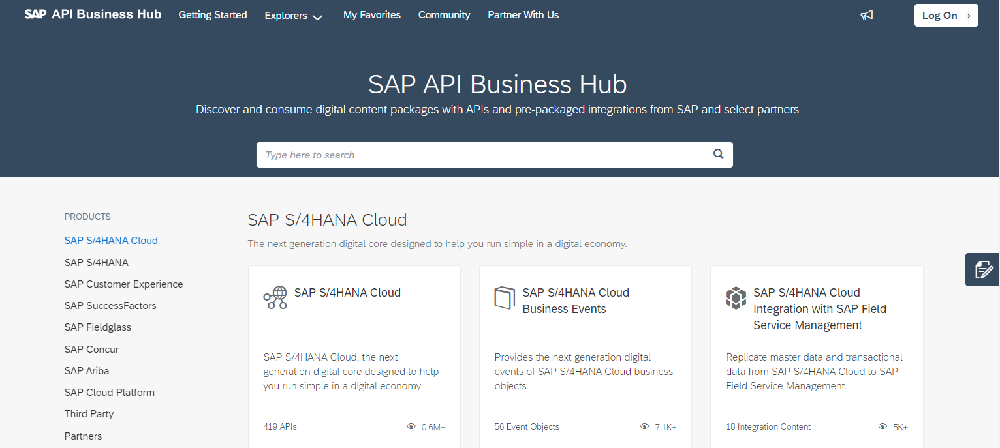
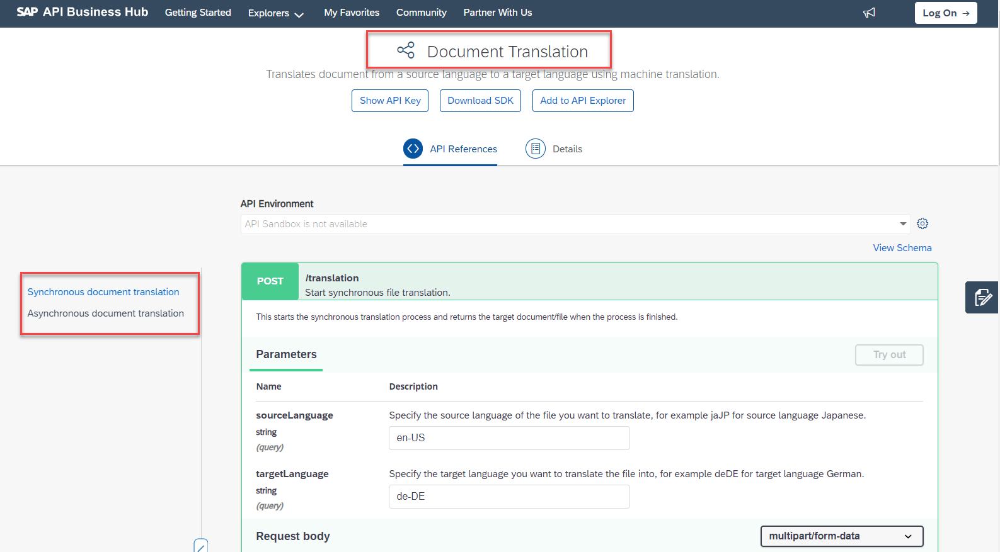
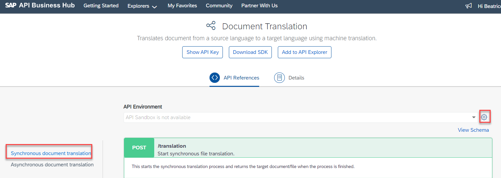
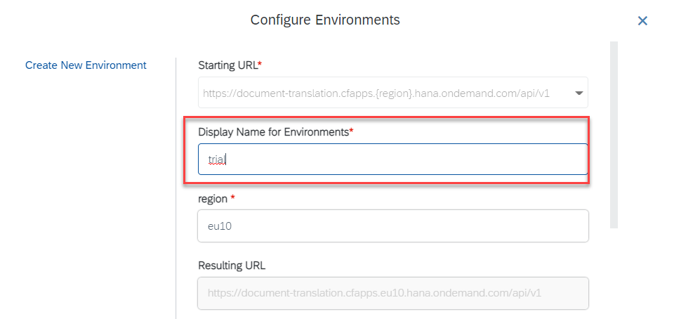
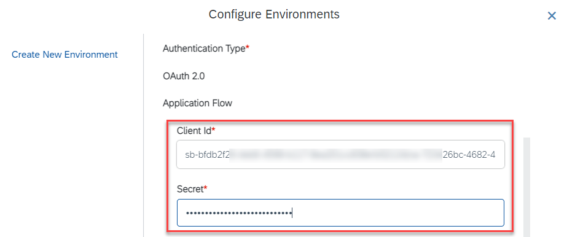
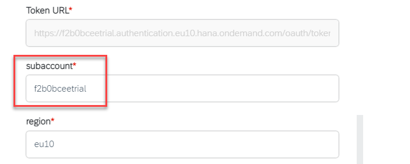
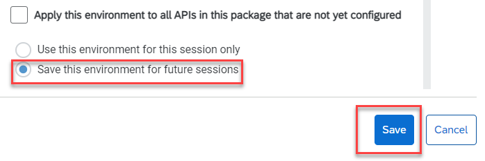
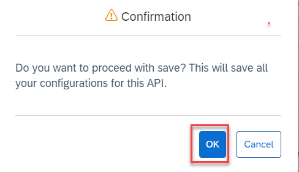

## Prerequisites
- You have created a trial account on SAP Cloud Platform: [Get a Free Trial Account on SAP Cloud Platform](hcp-create-trial-account)
  Hint: [Watch the video and learn how to create the account](https://www.youtube.com/watch?v=n5luSQKYvQQ&feature=emb_logo)
- You have a subaccount and dev space with **Europe (Frankfurt)** as region: [Manage Entitlements on SAP Cloud Platform Trial](cp-trial-entitlements). See also [Create a Subaccount](https://help.sap.com/viewer/65de2977205c403bbc107264b8eccf4b/Cloud/en-US/261ba9ca868f469baf64c22257324a75.html).
- You have created the credentials for Document Translation [Create Service Instance for Document Translation](sth-enable-document-translation)

## Details
### You will learn
 - How to get started with SAP API Business Hub
 - How to maintain the Document Translation credentials in SAP API Business Hub
 - How to translate a Document in SAP API Business Hub

[ACCORDION-BEGIN [Step 1: ](Navigate to the SAP API Business Hub)]
Follow the link to the [SAP API Business Hub] (https://api.sap.com/).
    

[DONE]
[ACCORDION-END]

[ACCORDION-BEGIN [Step 2: ](Log on to SAP API Business Hub)]
The SAP API Business Hub offers a test facility for APIs. In order to take advantage of this, you need to log on. Select `Log On` at the top of the page.
    

[DONE]
[ACCORDION-END]

[ACCORDION-BEGIN [Step 3: ](Search for Document Translation API)]
Search for `document translation` to find the Document Translation API and select the Document Translation Rest API.
    

[DONE]
[ACCORDION-END]

[ACCORDION-BEGIN [Step 4: ](Explore the Document Translation API)]
This will bring up the Document Translation API detail page, showing the two available APIs.
    
Take a minute to explore both APIs.

[DONE]
[ACCORDION-END]

[ACCORDION-BEGIN [Step 5: ](Maintain the API Environment)]
The service doesn't offer a sandbox system out of the box, therefor you have to connect your SAP Cloud Platform Trial account to the SAP API Business Hub. Select the `Gear wheel` symbol to open the Configure Environment screen.
    

[DONE]
[ACCORDION-END]

[ACCORDION-BEGIN [Step 6: ](Configure Environment)]
In the Configure Environment screen maintain the credentials for Document Translation as explained in the [Create Service Instance for Document Translation tutorial](sth-enable-document-translation)

1. Display name for Environments: maintain `trial`
    

2. Client ID and Client secret: take the information from the Document Translation credentials
    

3. sub-account: take the information from your SAP Cloud Platform cockpit - on the screen-shot you find `f2b0bceetrial` as account.
    
   Maintain the value `f2b0bceetrial` in SAP Business API Hub:
    

4. Save your settings also for future sessions
    

5. Confirm that you want to proceed with Save
    

[DONE]
[ACCORDION-END]

[ACCORDION-BEGIN [Step 7: ](Try out)]
Now your API Environment is maintained and you will see the `trial` entry.
Select the `Synchronous document translation` and Click on the `Try out` button. Please note that the button is only active if you are logged on.
    

[DONE]
[ACCORDION-END]

[ACCORDION-BEGIN [Step 8: ](Test an API endpoint)]
Selecting the `Try out` button will open any parameters in that section for input. Source and Target Language fields are already pre-filled with values for English and German. If you want to try out other language codes please refer to the available language information [here](https://help.sap.com/viewer/9f73362817cd48339dd8a6acba160f7f/Cloud/en-US/d10c5b0b66954cf48587c37af0bb7f1a.html).
Select a document from your file source system (Microsoft Word, Microsoft PowerPoint, Microsoft Excel or other file formats which are mentioned [here](https://help.sap.com/viewer/3d5f6dcbae624bd999bdd31708b2858e/dev/en-US/d10c5b0b66954cf48587c37af0bb7f1a.html)) and click on the `Execute` Button.
    

[DONE]
[ACCORDION-END]

[ACCORDION-BEGIN [Step 9: ](View the translation result)]
After some seconds you will see in the Response section a `Download file` link. Click on the link and the translated file will be downloaded.
    

Open the file and verify the translation result.
    

[DONE]

[VALIDATE_1]
[ACCORDION-END]

---
