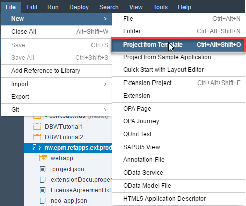
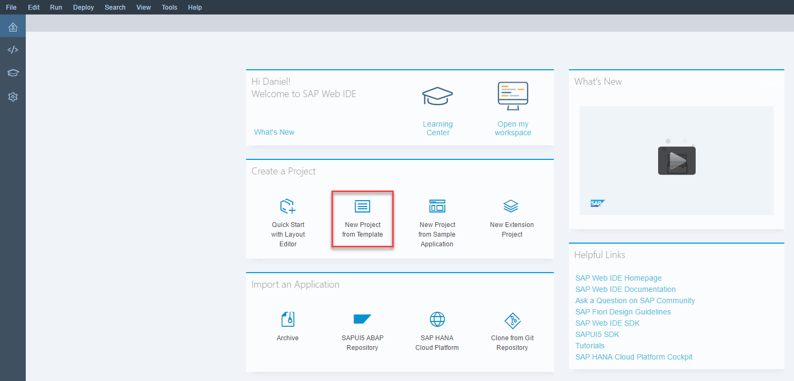

## Prerequisites  
 - None

## Next Steps
 - [Change Code in a Plugin]

## Details
### You will learn  
- How to create a feature project (which will contain a plugin module)
- How to add sample code to the plugin
- How to test the plugin

### Time to Complete
**10 Min**

---

[ACCORDION-BEGIN [Step 1: ](Create a new plugin project)]
After opening SAP Web IDE, choose **File** | **New** | **Project from Template**.

Alternatively, you can click the **New Project from Template** icon on the SAP Web IDE Welcome screen.

[DONE]
[ACCORDION-END]

[ACCORDION-BEGIN [Step 2: ](Select the feature template)]
In the wizard, do the following:

  1. On the **Template Selection** screen, choose **SAP Web IDE Feature**, and then **Next**.
    > If you don't see the feature template, make sure the **Category** selector is on **Feature and Plugin Development** or **All categories**.  

  2. On the **Basic Information** screen, enter `coolproject` for the project name, and then choose **Next**.
  3. On the **Template Customization** screen, enter the following:<table><thead><tr><th>Field</th><th>Value</th></tr></thead><tbody><tr><td>Feature Name</td><td>`coolfeature`</td></tr>
  <tr><td>Feature Description</td><td>`This is a cool feature`</td></tr>
  <tr><td>Plugin Name</td><td>`coolplugin`</td></tr>
  <tr><td>Plugin Description</td><td>`This is a cool plugin`</td></tr></tbody></table>
  4. Select the **Include sample implementation code** checkbox.
  
  5. Choose **Finish**.

[DONE]
[ACCORDION-END]

[ACCORDION-BEGIN [Step 3: ](Test the plugin)]
In the Workspace, right-click the **`plugin.json`** file and choose **Run** | **Run As Plugin**.
SAP Web IDE opens in a new browser tab called **Debug Mode**.

In the new browser tab, use the plugin by going to the **Tools** menu and selecting **Sample** | **Hello World**. A dialog opens with a message.  

[DONE]
[ACCORDION-END]

## Next Steps
- [Change Code in a Plugin]
