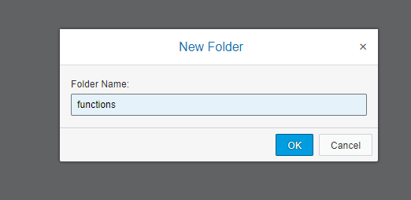
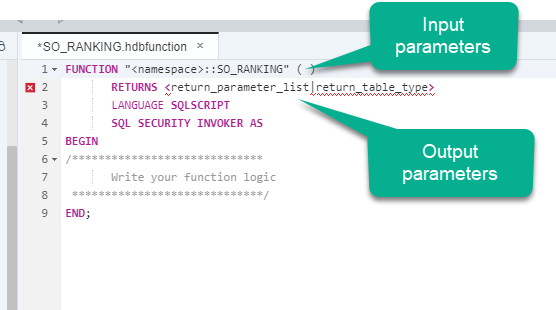
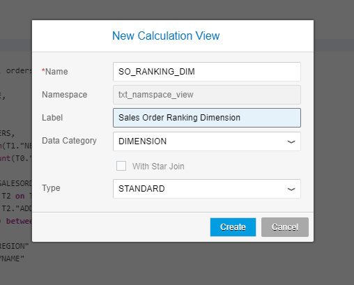
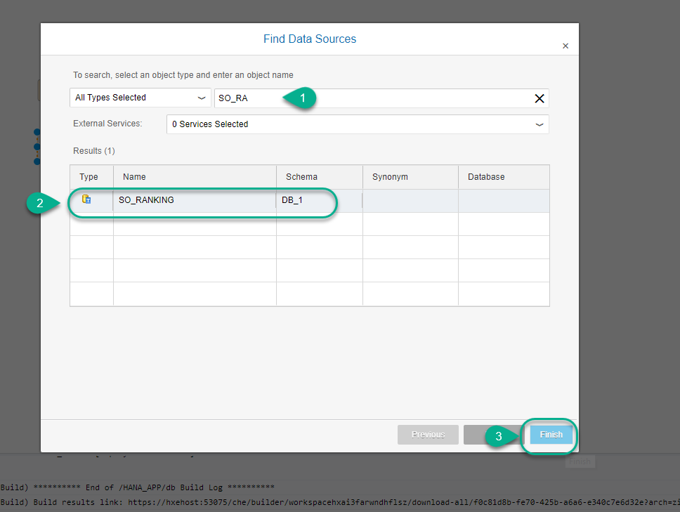
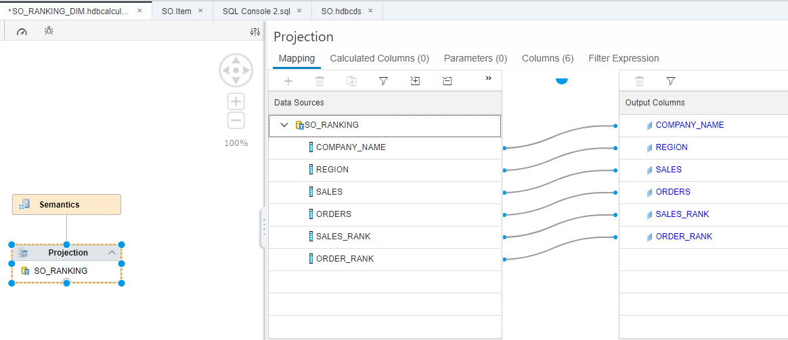
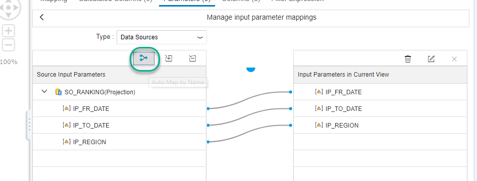

## Prerequisites  
 - [Getting started with SAP HANA, XS Advanced Development](https://www.sap.com/developer/groups/hana-xsa-get-started.html)
 - [Import sample data from the SHINE model](https://www.sap.com/developer/tutorials/xsa-import-shine-data.html)

## Details
### You will learn  
  - How to implement more complex logics using SQLScript in Table Functions
  - How to incorporate Table Functions in Graphical Calculation views
  - Create a replacement to the former Scripted Views in previous versions of SAP HANA
  - Apply the `DENSE_RANK` function, to establish the ranking of a row relative to a partition of a dataset

This tutorial assumes general knowledge of the modeling tool has been acquired through completion of the [beginner and intermediate tutorials about calculation views](https://developers.sap.com/group.hana-xsa-calculation-view-modeling.html).

---

[ACCORDION-BEGIN [Step 1: ](Create a function)]

In your `db/src` folder, create a new folder called `functions`.



Create a function called `SO_RANKING`


A template is created for you with different sections



Remove the placeholder for the namespace. Paste the following code into the input section:

```sql
IP_FR_DATE DATE,
IP_TO_DATE DATE,
IP_REGION NVARCHAR(4)

```

Add the following as a returning table:

```SQL
table ( COMPANY_NAME NVARCHAR(80),
                  REGION NVARCHAR(4),
                  SALES DECIMAL(18,2),
                  ORDERS INTEGER,
                  SALES_RANK INTEGER,
                  ORDER_RANK INTEGER  )  

```

Add the following code between `BEGIN` and `END`:

```sql

return

SELECT   company_name, region, sales, orders, sales_rank, order_rank from(  
  select
	 T2."COMPANYNAME" as COMPANY_NAME,
	 T3."REGION" as REGION,
	 sum(T1."NETAMOUNT") as SALES,
	 count(T0."SALESORDERID") as ORDERS,
	 dense_rank() over ( order by sum(T1."NETAMOUNT") desc ) as sales_rank,
	 dense_rank() over ( order by count(T0."SALESORDERID") desc ) as order_rank
	 from "SO.Header" T0
     inner join "SO.Item" T1 on T0."SALESORDERID" = T1."HEADER.SALESORDERID"
     inner join "MD.BusinessPartner" T2 on T0."PARTNER.PARTNERID" = T2."PARTNERID"
     inner join "MD.Addresses" T3 on T2."ADDRESSES.ADDRESSID" = T3."ADDRESSID"  
     where TO_DATE(T1."DELIVERYDATE") between :IP_FR_DATE and :IP_TO_DATE
       and T3."REGION" = :IP_REGION
     group by T2."COMPANYNAME", T3."REGION"
     order by sales_rank, T2."COMPANYNAME"
     )
     where sales_rank < 11;

```

**Save** and **build** the function. This is what it should look like


> For more information about `DENSE_RANK()` and other function modules, visit the [SAP HANA and System Views Reference](https://help.sap.com/viewer/4fe29514fd584807ac9f2a04f6754767/2.0.03/en-US/1a116cbd04a942e498ffef3a37b47461.html)

[DONE]

[ACCORDION-END]

[ACCORDION-BEGIN [Step 3: ](Test the function)]

You can test the function using the SQL console. Go into the database explorer and locate the function within your HDI container. Right-click on it and choose **Generate Select Statement**.


Use dates from `2014-12-01` to `2014-12-05` and region `EMEA` as parameters to complete the validation below. How many orders were sold by the company ranking number 1 in sales?

[VALIDATE_1]
[ACCORDION-END]


[ACCORDION-BEGIN [Step 3: ](Create a Calculation View)]

In the `src/models` folder, create a Calculation View of type dimension



Add your table function to the projection node



In the projection node, add all the columns to the output



[DONE]
[ACCORDION-END]

[ACCORDION-BEGIN [Step 4: ](Map parameters)]

Go to the parameters tab and click on **manage parameter mapping**


Choose the `Auto Map` button to automatically map the parameters to the columns in your calculation view



**Save** and **Build** your view.

> #What are the different types of views for?
> - Empty type: The view of type `default` or empty, is not exposed to BI tools and is free-form.
> - Cube: measures, aggregations. Exposed to BI Tools (generates BI Metadata)
> - Cube with star Join: Join fact data with dimension type calculation view. For example, join transactional data containing prices and discounts (facts) with data that helps to organize those facts, such as master data (customers, product categories) or time dimensions (quarters, years).
> - Dimension: No measures, no aggregations and no exposure to BI tools.

[DONE]
[ACCORDION-END]

[ACCORDION-BEGIN [Step 5: ](Test the Calculation View)]

Right-click on the calculation view and choose **data preview**. Fill the parameters as follows and click **Run**


The results are displayed and the rank functionality becomes obvious. Copy and paste the SQL statement in the validation below to complete it:

[VALIDATE_2]
[ACCORDION-END]

---
