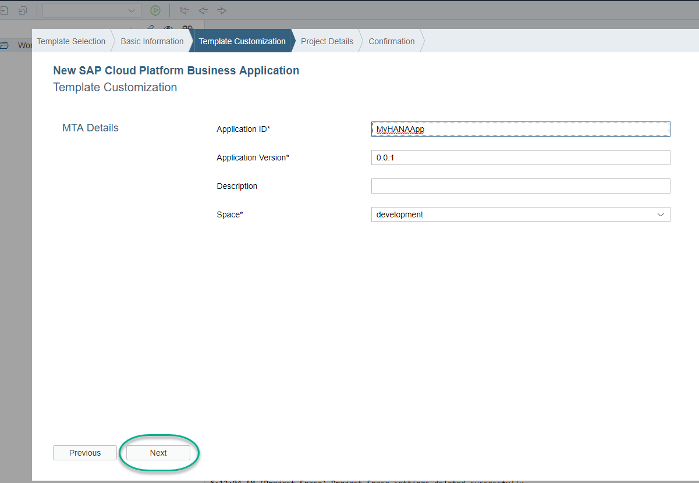
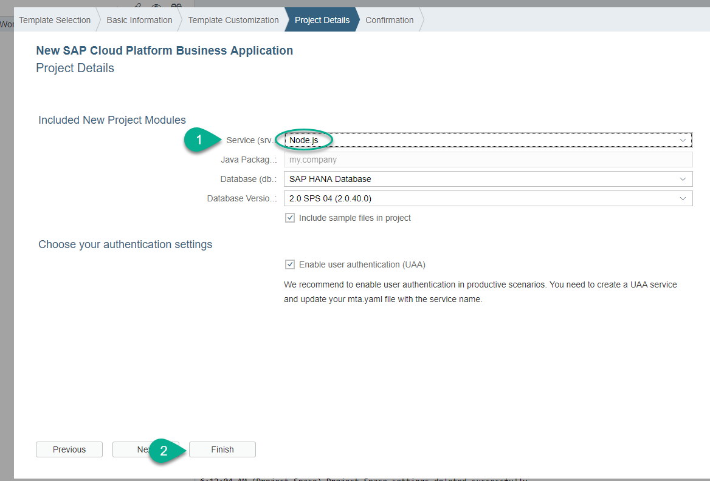
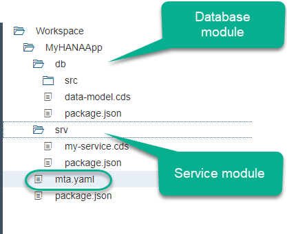
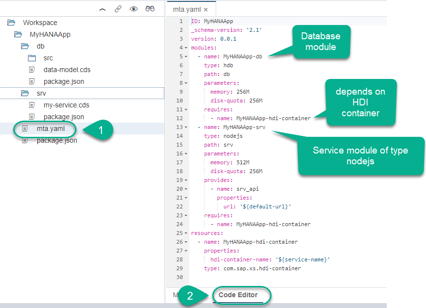
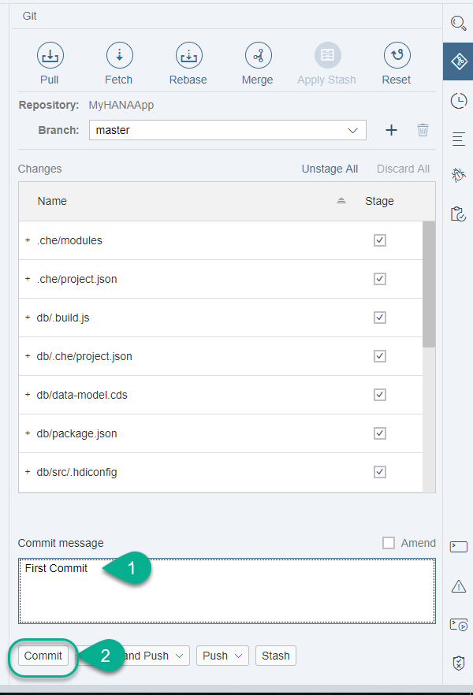

## Prerequisites
 - This tutorial is designed for SAP HANA on premise and SAP HANA, express edition. It is not designed for SAP HANA Cloud.
 - You have logged into SAP Web IDE for SAP HANA or the SAP Web IDE Full-stack. To find out more about SAP Web IDE and other tools in you SAP HANA, express edition instance, [refer to this tutorial](xsa-explore-basics). To learn more about SAP Web IDE Full-stack for HANA development [refer to this tutorial](hana-trial-advanced-analytics).
 - If you are planning on continuing the series in SAP HANA, express edition, it is recommended to [map the development space to the tenant database](xsa-tenant-db-space) **before starting development**.


## Details
### You will learn
  - How to create an application with the wizard for the Cloud Application Programming model
  - How to use the local Git repository for development/testing purposes

The images in this tutorial are based on SAP HANA, express edition SPS04.

---

[ACCORDION-BEGIN [Step 1: ](Create a new project)]

Log into SAP Web IDE.

> The default URL for SAP Web IDE in SAP HANA, express edition is `https://hxehost:53075`. The default user is `XSA_DEV`

**Right-click** on `Workspace` and select `New-> Project from Template`


Choose **SAP Cloud Platform Business Application** and click **Next**. (You may have to change the environment option in the wizard to Cloud Foundry if you are using the SAP Web IDE Full-stack)


Use the following name for your project and click **Next**

```Name
MyHANAApp
```
> **This name will be used in different steps**. It is recommended that you do not change it unless you remember to replace it in future tasks.



Choose `Node.js` as the service module and click **Finish**



[DONE]
[ACCORDION-END]

[ACCORDION-BEGIN [Step 2: ](Explore the generated artifacts)]

The wizard has generated a Multi-target Application with two modules: a database module and a service module. Expand them to familiarize yourself with the basic folder structure.



The wizard has also populated the `mta.yaml` configuration file with the necessary dependencies and parameters for each module. Open it in the code editor to explore it.



This file is the deployment descriptor and it is the glue that keeps all the micro-services together as a single application throughout its lifecycle. It declares the modules (applications or micro-services) and their dependencies with other micro-services or backing services. You can also use this file to inject variables into the environment variable `VCAP_SERVICES` of your application.

> This file is very sensitive to indentation and does not allow for tabs.


[DONE]
[ACCORDION-END]


[ACCORDION-BEGIN [Step 3: ](Initialize local Git repository)]

You will use the local Git repository for basic version management.

**Right-click** on the project and choose **Git -> Initialize Local Repository**.


You will be asked for an email address and user ID for a remote GitHub server. You can enter bogus values if you do not have an account in a remote GitHub repository.


After a few seconds, you will see a success message in the top-right corner. Use the Git icon next to it to open the Git pane.


[DONE]
[ACCORDION-END]

[ACCORDION-BEGIN [Step 4: ](Perform your first commit)]

Each time you commit to the local or remote repository, you create a version. This will allow you to revert and compare any changes.
**It is recommended that you perform commits at the end of each tutorial.**


Add a commit message and click **Commit**:



> It is recommended to set a remote repository in, for example, GitHub. This will allow you to have a copy of your code outside your SAP HANA instance.

Click the console icon and look at the messages to complete the validation below.

[VALIDATE_1]
[ACCORDION-END]

---
