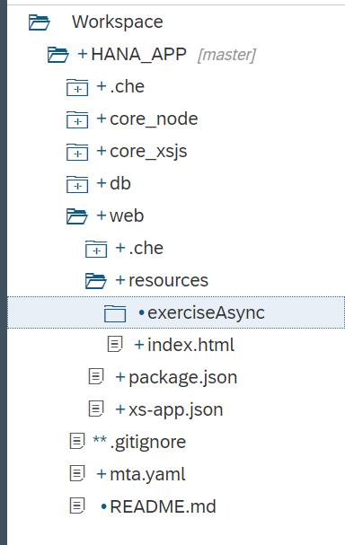
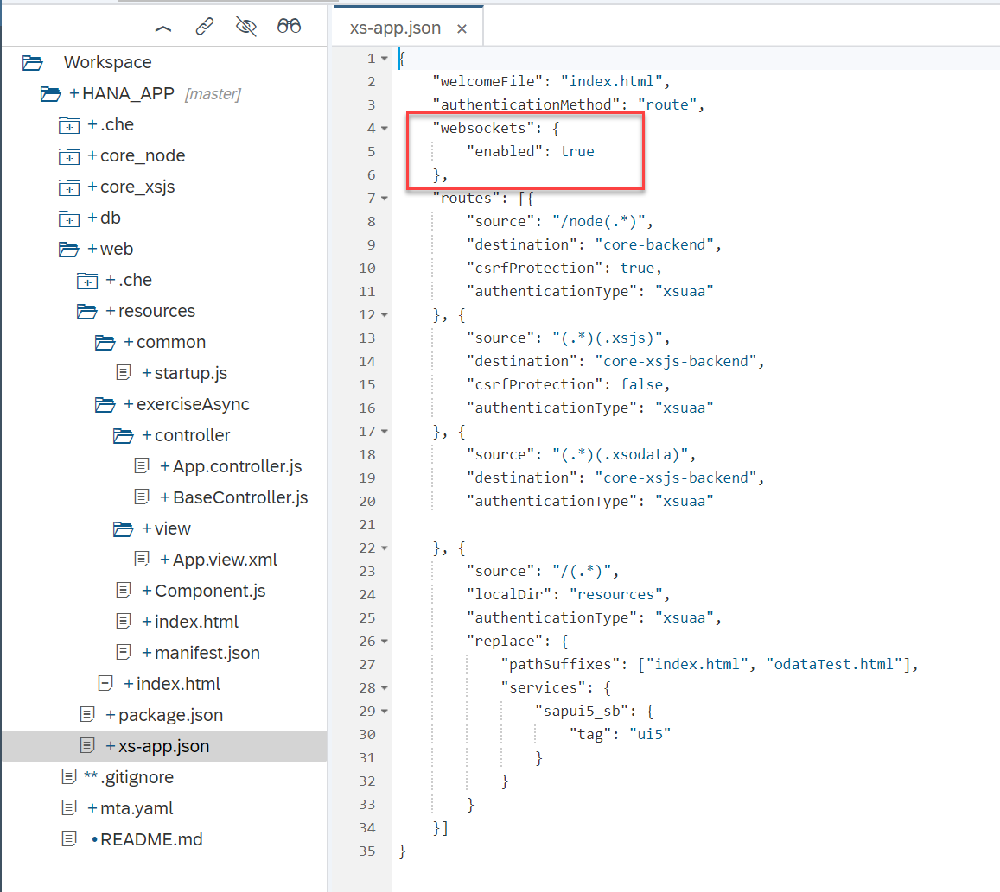
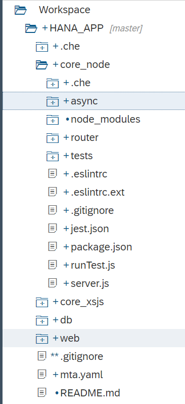
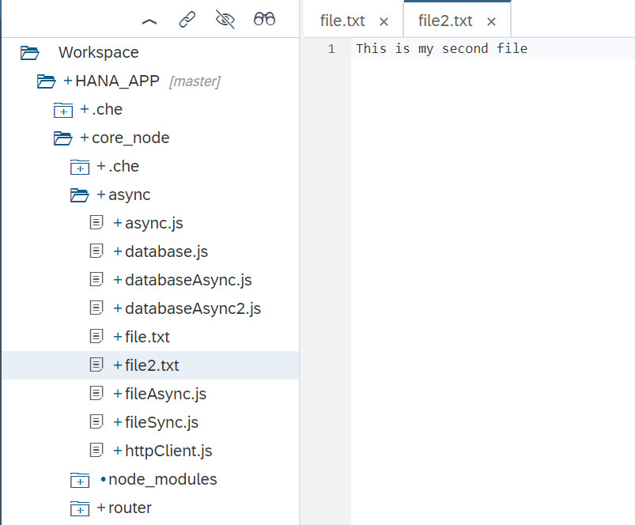
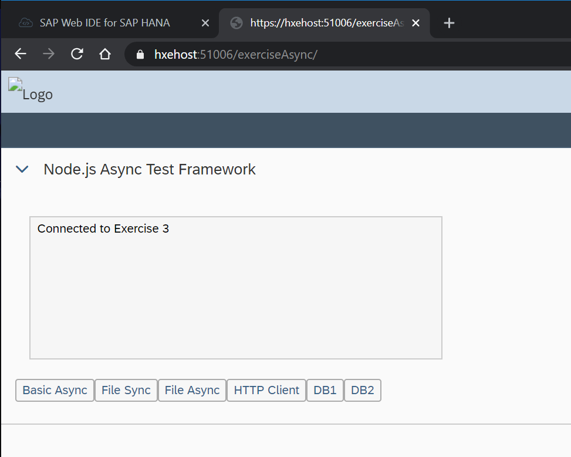

## Prerequisites  
 - This tutorial is designed for SAP HANA on premise and SAP HANA, express edition. It is not designed for SAP HANA Cloud.
 - **Proficiency:** Intermediate
 - **Tutorials:** [HANA Database Access from Node.js](https://developers.sap.com/tutorials/xsa-node-dbaccess.html)

## Next Steps
 - [Text Bundles](https://developers.sap.com/tutorials/xsa-node-text.html)

## Details
### You will learn  
you will learn about the fundaments of the asynchronous nature of Node.js You will so see how this asynchronous capability allows for non-blocking input and output. This technique is one of the basic things that makes Node.js development different from other JavaScript development and also creates one of the reasons for its growing popularity. We will see how these techniques are applied to common operations like HTTP web service calls or even SAP HANA database access.


### Time to Complete
**30 Min**.

---


[ACCORDION-BEGIN [Step 1: ](Add second module require statement)]

Return to the Node.js module and the `index.js` source file. Add a second module require statement for `./exerciseAsync`

```JavaScript
/*eslint no-console: 0, no-unused-vars: 0, no-undef:0, no-process-exit:0*/
/*eslint-env node, es6 */
"use strict";

module.exports = (app, server) => {
	app.use("/node", require("./routes/myNode")());
	app.use("/node/excAsync", require("./routes/exerciseAsync")(server));

	app.use( (err, req, res, next) => {
		console.error(JSON.stringify(err));
		res.status(500).send(`System Error ${JSON.stringify(err)}`);
	});
};

```

[DONE]

[ACCORDION-END]

[ACCORDION-BEGIN [Step 2: ](Add an express route handler)]

From the code you have just added, you can guess you will need a new file called `exerciseAsync.js` inside your `routes` folder. This is just a test framework.

```JavaScript
/*eslint no-console: 0, no-unused-vars: 0, new-cap:0 */
/*eslint-env node, es6 */
"use strict";
var express = require("express");
var WebSocketServer = require("ws").Server;

module.exports = function (server) {
	var app = express.Router();
	const asyncLib = require(global.__base + "async/async.js");
	const dbAsync = require(global.__base + "async/databaseAsync.js");
	const dbAsync2 = require(global.__base + "async/databaseAsync2.js");
	const fileSync = require(global.__base + "async/fileSync.js");
	const fileAsync = require(global.__base + "async/fileAsync.js");
	const httpClient = require(global.__base + "async/httpClient.js");

	app.use((req, res) => {
		var output =
			`<H1>Asynchronous Examples</H1></br>
			<a href="/exerciseAsync">/exerciseAsync</a> - Test Framework for Async Examples</br>` +			
			require(global.__base + "utils/exampleTOC").fill();
		res.type("text/html").status(200).send(output);
	});
	try {
		var wss = new WebSocketServer({
			//server: server
			noServer: true
		});

		server.on("upgrade", function upgrade(request, socket, head) {
			const url = require("url");
			const pathname = url.parse(request.url).pathname;

			if (pathname === "/node/excAsync") {
				wss.handleUpgrade(request, socket, head, function done(ws) {
					wss.emit("connection", ws, request);
				});
			}
		});

		wss.broadcast = (data) => {
			var message = JSON.stringify({
				text: data
			});
			wss.clients.forEach(function each(client) {
				try {
					client.send(message, function ack(error) {
						if (typeof error !== "undefined") {
							console.log(`Send Error: ${error.toString()}`);
						}
					});
				} catch (e) {
					console.log(`Broadcast Error: ${e.toString()}`);
				}
			});
			console.log(`Sent: ${message}`);

		};
		wss.on("error", (error) => {
			console.log(`Web Socket Server Error: ${error.toString()}`);
		});

		wss.on("connection", (ws) => {
			console.log("Connected");

			ws.on("message", (message) => {
				console.log(`Received: ${message}`);
				var data = JSON.parse(message);
				switch (data.action) {
				case "async":
					asyncLib.asyncDemo(wss);
					break;
				case "fileSync":
					fileSync.fileDemo(wss);
					break;
				case "fileAsync":
					fileAsync.fileDemo(wss);
					break;
				case "httpClient":
					httpClient.callService(wss);
					break;
				case "dbAsync":
					dbAsync.dbCall(wss);
					break;
				case "dbAsync2":
					dbAsync2.dbCall(wss);
					break;
				default:
					wss.broadcast(`Error: Undefined Action: ${data.action}`);
					break;
				}
			});
			ws.on("close", () => {
				console.log("Closed");
			});
			ws.on("error", (error) => {
				console.log(`Web Socket Error: ${error.toString()}`);
			});
			ws.send(JSON.stringify({
				text: "Connected to Exercise 3"
			}), function ack(error) {
				if (typeof error !== "undefined") {
					console.log(`Send Error: ${error.toString()}`);
				}
			});
		});
	} catch (e) {
		console.log(`General Error: ${e.toString()}`);
	}
	return app;
};
```

[DONE]

[ACCORDION-END]

[ACCORDION-BEGIN [Step 3: ](Create a test UI)]

You will create a quick web user interface within your existing web module to use your test framework with. Create a new folder called `exerciseAsync` in your `web->resources` file.



The first file will be the `Component.js`, with the following code:

```JavaScript
/*eslint no-console: 0, no-unused-vars: 0, no-use-before-define: 0, no-redeclare: 0*/
sap.ui.define([
	"sap/ui/core/UIComponent"
], function (UIComponent) {
	"use strict";

	return UIComponent.extend("sap.xs.exerciseAsync.Component", {

		metadata: {
			manifest: "json"
		},

		init: function () {
			sap.ui.core.UIComponent.prototype.init.apply(
				this, arguments);

			// Chat Model
			var oModel = this.getModel("chatModel");
			oModel.setData({
				chat: "",
				message: ""
			});
		},

		destroy: function () {
			// call the base component's destroy function
			UIComponent.prototype.destroy.apply(this, arguments);
		}

	});

});
```

Create the `manifest.json` file. You would generally declare the internationalization model here (i18n) but you will hard code the texts in English as it is not the focus of this exercise.


```JSON
{
	"_version": "1.4.0",
	"start_url": "index.html",
	"sap.app": {
		"_version": "1.4.0",
		"type": "application",
		"resources": "resources.json",
		"i18n": "i18n/i18n.properties",
		"id": "exerciseAsync",
		"title": "{{appTitle}}",
		"description": "{{appDescription}}",
		"applicationVersion": {
			"version": "${project.version}"
		}
	},
	"sap.fiori": {
		"_version": "2.0.0",
		"registrationIds": [],
		"archeType": "transactional"
	},
	"sap.ui": {
		"_version": "1.60.0",
		"technology": "UI5",
		"icons": {
			"icon": "/images/favicon.ico",
			"favIcon": "/images/favicon.ico"
		},
		"deviceTypes": {
			"desktop": true,
			"tablet": true,
			"phone": true
		},
		"supportedThemes": [
			"sap_belize",
			"sap_belize_plus"
		]
	},
	"sap.ui5": {
		"config": {
			"sapFiori2Adaptation": true
		},
		"rootView": {
			"viewName": "sap.xs.exerciseAsync.view.App",
			"type": "XML",
			"id": "app",
			"async": true
		},
		"dependencies": {
			"minUI5Version": "1.60.0",
			"libs": {
				"sap.ui.core": {
					"minVersion": "1.60.0"
				},
				"sap.m": {
					"minVersion": "1.60.0"
				},
				"sap.ui.layout": {
					"minVersion": "1.60.0"
				}
			}
		},
		"contentDensities": {
			"compact": true,
			"cozy": true
		},
		"handleValidation": true,
		"models": {
			"chatModel": {
				"type": "sap.ui.model.json.JSONModel",
				"settings": {
					"defaultBindingMode": "TwoWay"
				}
			},
			"config": {
				"type": "sap.ui.model.json.JSONModel"
			},
			"i18n": {
				"type": "sap.ui.model.resource.ResourceModel",
				"settings": {
					"bundleUrl": "./i18n/i18n.properties"
				}
			}
		}

	}
}
```

Create an `index.html` file with the following content:

```html
<!DOCTYPE html>
<html>
<head>
	<meta http-equiv="X-UA-Compatible" content="IE=edge" />
	<meta charset="UTF-8">
	<meta name="viewport" content="width=device-width, initial-scale=1.0, maximum-scale=1.0, user-scalable=no" />
	    <!-- <script id="sap-ui-bootstrap" src="https://sapui5.hana.ondemand.com/resources/sap-ui-core.js" -->
	<script id="sap-ui-bootstrap" src="{{{sapui5_sb.url}}}/resources/sap-ui-core.js"
		data-sap-ui-theme="sap_belize_plus"
		data-sap-ui-xx-bindingSyntax="complex"
		data-sap-ui-compatVersion="edge"
		data-sap-ui-preload="async"
		data-sap-ui-language="en"
		data-sap-ui-resourceroots='{
				"sap.xs.exerciseAsync": "./",
				"view": "./view" }'			
		data-sap-ui-libs="sap.m,sap.ui.comp,sap.ui.core,sap.ui.layout,sap.ui.unified">
	</script>

	<script type="text/javascript" src="../common/startup.js"></script>
	<script>
		localShellStartup("sap.xs.exerciseAsync");
	</script>
</head>
<body class="sapUiBody" role="application">
	<div id="content"></div>
</body>
</html>
```

You will now create the views and controller in their corresponding folders within the `exerciseAsync` folder and the following code, respectively. The name of the components is referenced as `App` as you can see in the root view specified in `manifest.json`

`view/App.view.xml`
```XML
<mvc:View controllerName="sap.xs.exerciseAsync.controller.App" xmlns="sap.m" xmlns:l="sap.ui.layout" xmlns:mvc="sap.ui.core.mvc"
	height="100%">
	<Page title="{i18n>appTitle}">
		<content>
			<ScrollContainer height="100%" width="100%" horizontal="true" vertical="true">
				<Panel headerText="Node.js Async Test Framework" expandable="true" expanded="true">
					<l:VerticalLayout class="sapUiContentPadding" width="100%">
						<l:content>
							<TextArea id="chatInfo" value="{chatModel>/chat}" cols="60" rows="8" editable="false"/>
						</l:content>
					</l:VerticalLayout>
					<Button text="Basic Async" press="sendBasic"/>
					<Button text="File Sync" press="sendFileS"/>
					<Button text="File Async" press="sendFileA"/>
					<Button text="HTTP Client" press="sendHTTP"/>
					<Button text="DB1" press="sendDB1"/>
					<Button text="DB2" press="sendDB2"/>
				</Panel>
			</ScrollContainer>
		</content>
	</Page>
</mvc:View>
```

`controller/App.controller.js`:

```JavaScript
/*eslint no-console: 0, no-unused-vars: 0, no-use-before-define: 0, no-redeclare: 0, no-undef: 0, no-sequences: 0, no-unused-expressions: 0*/
//To use a javascript controller its name must end with .controller.js
sap.ui.define([
	"sap/xs/exerciseAsync/controller/BaseController",
	"sap/ui/model/json/JSONModel"
], function(BaseController, JSONModel) {
	"use strict";
	jQuery.sap.require("sap.ui.core.ws.WebSocket");
    var connection = new sap.ui.core.ws.WebSocket("/node/excAsync");
	return BaseController.extend("sap.xs.exerciseAsync.controller.App", {

		onInit: function() {

			this.getView().addStyleClass("sapUiSizeCompact"); // make everything inside this View appear in Compact mode

			// connection opened
			connection.attachOpen(function(oControlEvent) {
				sap.m.MessageToast.show("connection opened");
			});

			// server messages
			connection.attachMessage(function(oControlEvent) {
				var oModel = sap.ui.getCore().getComponent("comp").getModel("chatModel");
				var result = oModel.getData();

				var data = jQuery.parseJSON(oControlEvent.getParameter("data"));
				var msg = data.text,
					lastInfo = result.chat;

				if (lastInfo.length > 0) {
					lastInfo += "\r\n";
				}
				oModel.setData({
					chat: lastInfo + msg
				}, true);

				// scroll to textarea bottom to show new messages
			//	$("#comp---app--chatInfo-inner").scrollTop($("#comp---app--chatInfo-inner")[0].scrollHeight);
			});

			// error handling
			connection.attachError(function(oControlEvent) {
				sap.m.MessageToast.show("Websocket connection error");
			});

			// onConnectionClose
			connection.attachClose(function(oControlEvent) {
				sap.m.MessageToast.show("Websocket connection closed");
			});

		},

		// send message
		sendBasic: function() {
			var oModel = this.getOwnerComponent().getModel("chatModel");
			oModel.setData({
				chat: ""
			}, true);
			connection.send(JSON.stringify({
				action: "async"
			}));
		},
		sendFileS: function() {
			var oModel = this.getOwnerComponent().getModel("chatModel");
			oModel.setData({
				chat: ""
			}, true);
			connection.send(JSON.stringify({
				action: "fileSync"
			}));
		},

		sendFileA: function() {
			var oModel = this.getOwnerComponent().getModel("chatModel");
			oModel.setData({
				chat: ""
			}, true);
			connection.send(JSON.stringify({
				action: "fileAsync"
			}));
		},
		sendHTTP: function() {
			var oModel = this.getOwnerComponent().getModel("chatModel");
			oModel.setData({
				chat: ""
			}, true);
			connection.send(JSON.stringify({
				action: "httpClient"
			}));
		},
		sendDB1: function() {
			var oModel = this.getOwnerComponent().getModel("chatModel");
			oModel.setData({
				chat: ""
			}, true);
			connection.send(JSON.stringify({
				action: "dbAsync"
			}));
		},
		sendDB2: function() {
			var oModel = this.getOwnerComponent().getModel("chatModel");
			oModel.setData({
				chat: ""
			}, true);
			connection.send(JSON.stringify({
				action: "dbAsync2"
			}));
		},
		onErrorCall: function(oError) {
			if (oError.statusCode === 500 || oError.statusCode === 400 || oError.statusCode === "500" || oError.statusCode === "400") {
				var errorRes = JSON.parse(oError.responseText);
				if (!errorRes.error.innererror) {
					sap.m.MessageBox.alert(errorRes.error.message.value);
				} else {
					if (!errorRes.error.innererror.message) {
						sap.m.MessageBox.alert(errorRes.error.innererror.toString());
					} else {
						sap.m.MessageBox.alert(errorRes.error.innererror.message);
					}
				}
				return;
			} else {
				sap.m.MessageBox.alert(oError.response.statusText);
				return;
			}

		}
	});
});
```

`controller/BaseController.controller.js`:

```JavaScript
/*global history */
sap.ui.define([
		"sap/ui/core/mvc/Controller",
		"sap/ui/core/routing/History"
	], function (Controller, History) {
		"use strict";

		return Controller.extend("sap.xs.exerciseAsync.controller.BaseController", {
			/**
			 * Convenience method for accessing the router in every controller of the application.
			 * @public
			 * @returns {sap.ui.core.routing.Router} the router for this component
			 */
			getRouter : function () {
				return this.getOwnerComponent().getRouter();
			},

			/**
			 * Convenience method for getting the view model by name in every controller of the application.
			 * @public
			 * @param {string} sName the model name
			 * @returns {sap.ui.model.Model} the model instance
			 */
			getModel : function (sName) {
				return this.getView().getModel(sName);
			},

			/**
			 * Convenience method for setting the view model in every controller of the application.
			 * @public
			 * @param {sap.ui.model.Model} oModel the model instance
			 * @param {string} sName the model name
			 * @returns {sap.ui.mvc.View} the view instance
			 */
			setModel : function (oModel, sName) {
				return this.getView().setModel(oModel, sName);
			},

			/**
			 * Convenience method for getting the resource bundle.
			 * @public
			 * @returns {sap.ui.model.resource.ResourceModel} the resourceModel of the component
			 */
			getResourceBundle : function () {
				return this.getOwnerComponent().getModel("i18n").getResourceBundle();
			},

			/**
			 * Event handler for navigating back.
			 * It there is a history entry we go one step back in the browser history
			 * If not, it will replace the current entry of the browser history with the master route.
			 * @public
			 */
			onNavBack : function() {
				var sPreviousHash = History.getInstance().getPreviousHash();

					if (sPreviousHash !== undefined) {
					history.go(-1);
				} else {
					this.getRouter().navTo("master", {}, true);
				}
			}

		});

	}
);
```

Now we need to create one reusable JavaScript library that will be utilized by several frontend applications. In your web/resources folder create a new folder named common.  Within the common folder create a file named startup.js.

`web/resources/common/startup.js`
```JavaScript
/*eslint no-console: 0, no-unused-vars: 0, no-use-before-define: 0, no-redeclare: 0, no-shadow:0*/
function onLoadSession(myJSON) {
	try {
		var result = JSON.parse(myJSON);
		if (result.session.length > 0) {
			if (result.session[0].familyName !== "") {
				return result.session[0].givenName + " " + result.session[0].familyName;
			} else {
				return result.session[0].UserName;
			}
		}
	} catch (e) {
		return "";
	}
	return "";
}

function getSessionInfo() {
	var aUrl = "/node/getSessionInfo";

	return onLoadSession(
		jQuery.ajax({
			url: aUrl,
			method: "GET",
			dataType: "json",
			async: false
		}).responseText);
}

function localShellStartup(name) {

	sap.ui.getCore().attachInit(function () {
		var ComponentContainer = new sap.ui.core.ComponentContainer({
			height: "100%"
		});
		var username = "Test User";
		// create a shell
		new sap.ui.unified.Shell({
			id: "myShell",
			icon: "/images/sap_18.png",
			headEndItems: new sap.ui.unified.ShellHeadItem({
				icon: "sap-icon://log",
				tooltip: "Logoff",
				press: function () {
					window.location.href = "/my/logout";
				}
			}),
			user: new sap.ui.unified.ShellHeadUserItem({
				image: "sap-icon://person-placeholder",
				username: username
			}),
			content: ComponentContainer
		}).placeAt("content");

		var oComponent = sap.ui.component({
			id: "comp",
			name: name,
			manifestFirst: true,
			async: true
		}).then(function (oComponent) {
			ComponentContainer.setComponent(oComponent);
		});

	});
}
```

[DONE]

[ACCORDION-END]

[ACCORDION-BEGIN [Step 4: ](Enable websockets)]

Add the following under the `authenticationMethod` in `xs-app.json`:

```
"websockets": {
		"enabled": true
	},

```



[DONE]

[ACCORDION-END]

[ACCORDION-BEGIN [Step 5: ](Create an async folder)]

Create a folder under `core_node` called `async`. This is where you will create the rest of the files in this section.



You will create 7 files. Use the following names and the code snippets to create them within the `core_node->async` folder:

`async.js`

```JavaScript
/*eslint-env node, es6 */
"use strict";
module.exports = {
   asyncDemo: (wss) => {
	 	wss.broadcast("Start");
		setTimeout(() => {
			wss.broadcast("Wait Timer Over");
		}, 3000);
		wss.broadcast("End");
  }
};

```
`database.js`

```JavaScript
/*eslint no-console: 0, no-unused-vars: 0, no-undef: 0, no-shadow: 0*/
"use strict";
var hdb = require("@sap/hdbext");
var xsenv = require("@sap/xsenv");
var async = require("async");
var hanaOptions = xsenv.getServices({
	hana: {
		plan: "hdi-shared"
	}
});
hanaOptions.hana.pooling = true;

module.exports = {
	callHANA: function (wss) {
		hdb.createConnection(hanaOptions.hana, function (error, client) {
			if (error) {
				console.error(error);
			}
			if (client) {
				wss.broadcast("Database Connected");
				client.exec("select TOP 25 * from \"PurchaseOrder.Header\"",
					function (err, res, cb) {
						if (err) {
							return ("ERROR: " + err);
						}
						wss.broadcast("Database Call Complete");
						for (var i = 0; i < res.length; i++) {
							wss.broadcast(res[i].PURCHASEORDERID + ": " + res[i].GROSSAMOUNT + "\n");
						}
						client.disconnect(function (cb) {
							wss.broadcast("Database Disconnected");
						//	pool.release(client);
						});
						return null;
					});
			} //End if client
		}); //end create connection      
		cb();
	}, //end callHANA

	callHANA1: function (cb, wss) {
		hdb.createConnection(hanaOptions.hana, function (error, client) {
			if (error) {
				console.error(error);
			}
			if (client) {

				async.waterfall([

					function execute(callback) {
						wss.broadcast("Database Connected #1");
						client.exec("select TOP 25 * from \"PurchaseOrder.Header\"",
							function (err, res) {
								if (err) {
									return ("ERROR: " + err);
								}
								callback(null, err, res);
								return null;
							});
						return null;
					},

					function processResults(err, res, callback) {
						if (err) {
							return ("ERROR: " + err);
						}
						wss.broadcast("Database Call  #1");
						wss.broadcast("--PO Header");
						for (var i = 0; i < res.length; i++) {
							wss.broadcast(res[i].PURCHASEORDERID + ": " + res[i].GROSSAMOUNT);
						}
						wss.broadcast("\n");
						client.disconnect();
						wss.broadcast("Database Disconnected #1");
						wss.broadcast("End Waterfall #1");
						//pool.release(client);
						cb();
						return null;
					},

					function disconnectDone(callback) {
						wss.broadcast("Database Disconnected #1");
						wss.broadcast("End Waterfall #1");
					//	pool.release(client);
						cb();
					}

				], function (err, result) {
					wss.broadcast(err || "done");
					wss.broadcast("Error Occured disrupting flow of Waterfall for #1");
				//	pool.release(client);
					cb();
				}); //end Waterfall

			} //end if client
		}); //end create connection

	}, //end callHANA1

	callHANA2: function (cb, wss) {

				hdb.createConnection(hanaOptions.hana, function (error, client) {
				if (error) {
					console.error(error);
				}
				if (client) {

					async.waterfall([

						function execute(callback) {
							wss.broadcast("Database Connected #2");
							client.exec("select TOP 25 * from \"PurchaseOrder.Item\"",
								function (err, res) {
									if (err) {
										return ("ERROR: " + err);
									}
									callback(null, err, res);
									return null;
								});

						},

						function processResults(err, res, callback) {
							if (err) {
								return ("ERROR: " + err);
							}
							wss.broadcast("Database Call  #2");
							wss.broadcast("--PO Items");
							for (var i = 0; i < res.length; i++) {
								wss.broadcast(res[i]["POHeader.PURCHASEORDERID"] + ": " + res[i]["PRODUCT"]);
							}
							wss.broadcast("\n");
							client.disconnect();
							wss.broadcast("Database Disconnected #2");
							wss.broadcast("End Waterfall #2");
						//	pool.release(client);
							cb();
							return null;
						},

						function disconnectDone(callback) {
							wss.broadcast("Database Disconnected #2");
							wss.broadcast("End Waterfall #2");
						//	pool.release(client);
							cb();
						}

					], function (err, result) {
						wss.broadcast(err || "done");
						wss.broadcast("Error Occured disrupting flow of Waterfall for #2");
					//	pool.release(client);
						cb();
					}); //end Waterfall
				} //end if client
			}); //end create connection

		} //end callHANA2
};
```

`databaseAsync.js`

```JavaScript
/*eslint-env node, es6 */
"use strict";
var hana = require("./database");
module.exports = {
	dbCall: (wss) => {
		function dummy() {}
		wss.broadcast("Before Database Call");
		hana.callHANA1(dummy, wss);
		hana.callHANA2(dummy, wss);
		wss.broadcast("After Database Call");
	}
};
```

`fileAsync.js`

```JavaScript
/*eslint-env node, es6 */
"use strict";
var fs = require("fs");

module.exports = {
	fileDemo: (wss) => {
		fs.readFile("./async/file.txt", "utf8", (error, text) => {
			wss.broadcast(text);
		});
		wss.broadcast("After First Read\n");

		fs.readFile("./async/file2.txt", "utf8", (error, text) => {
			wss.broadcast(text);
		});
		wss.broadcast("After Second Read\n");

	}
};
```

`fileSync.js`

```JavaScript
/*eslint-env node, es6 */
"use strict";
var fs = require("fs");

module.exports = {
	fileDemo: (wss) => {
		var text = fs.readFileSync("./async/file.txt", "utf8");
		wss.broadcast(text);

		wss.broadcast("After First Read\n");

		text = fs.readFileSync("./async/file2.txt", "utf8");
		wss.broadcast(text);

		wss.broadcast("After Second Read\n");

	}
};
```
`httpClient.js`

```JavaScript
/*eslint-env node, es6 */
"use strict";
var http = require("http");
module.exports = {
	callService: (wss) => {
		wss.broadcast("Before HTTP Call\n");
		try {
			http.get({
					path: "http://www.loc.gov/pictures/search/?fo=json&q=SAP&",
					host: "www.loc.gov",
					port: "80",
					headers: {
						host: "www.loc.gov"
					}
				},
				(response) => {
					response.setEncoding("utf8");
					response.on("data", (data) => {
						wss.broadcast(data.substring(0, 100));
					});
					response.on("error", wss.broadcast);
				});
		} catch (err) {
			wss.broadcast(err.toString());
		}
		wss.broadcast("After HTTP Call\n");
	}
};
```
`databaseAsync2.js`

```JavaScript
/*eslint no-console: 0, no-unused-vars: 0, no-undef: 0, no-shadow: 0*/
/*eslint-env node, es6 */
"use strict";
var hana = require("./database");
var async = require("async");
module.exports = {
	dbCall: (wss) => {
		async.parallel([
			function(cb) {
				wss.broadcast("Before Database Call");
				cb();
			},
			function(cb) {
				hana.callHANA1(cb, wss);
			},
			function(cb) {
				hana.callHANA2(cb, wss);
			},
			function(cb) {
				wss.broadcast("After Database Call");
				cb();
			}
		], function(err) {
			wss.broadcast("---Everything's Really Done Now. Go Home!---");
		});

	}
};
```

[DONE]

[ACCORDION-END]

[ACCORDION-BEGIN [Step 6: ](Create the Text Files)]

Take a look at the code you have just created. You will notice the file modules are using two text files. Create them inside the `async` folder using simple lines like `file.txt` with `This is my first file` and `file2.txt` with `This is my second file`



[DONE]

[ACCORDION-END]

[ACCORDION-BEGIN [Step 7: ](Build and Run)]

You can now run the `core_node` module

You should see that the build and deploy was successful and that the application is running. Also run the web module

In the running tab, you should see the `index.html` with the `Hello World` button from earlier.  

Now change the path in the browser to `/exerciseAsync`. You should see the test framework for this exercise.  



[DONE]

[ACCORDION-END]


[ACCORDION-BEGIN [Step 8: ](Test synchronous operations)]

What do you expect this code will output? From many other programming languages you would expect sequential processing and therefore the End output wouldn't come until after the timer expired. However part of the power of Node.js is asynchronous non-blocking execution of many core elements. In test UI, press the Basic `Async` button.


Perhaps a timer seemed like an obvious asynchronous operation. However this asynchronous nature of Node.js is often used when programs must wait on input or output. When asynchronous processing is applied to these operations, you can keep from blocking execution of other logic while you wait on things like file access, HTTP requests or even database query execution. Now look at the difference between synchronous and asynchronous file operations.


The `fileSync.js` is using the `fs` library and the function `readFileSync` to read each of the two text files. After each read operation output there is a message.

```JavaScript
/*eslint-env node, es6 */
"use strict";
var fs = require("fs");

module.exports = {
	fileDemo: (wss) => {
		var text = fs.readFileSync("./async/file.txt", "utf8");
		wss.broadcast(text);

		wss.broadcast("After First Read\n");

		text = fs.readFileSync("./async/file2.txt", "utf8");
		wss.broadcast(text);

		wss.broadcast("After Second Read\n");

	}
};
```

Test your `fileSync.js` from the UI test tool. As you might expect, everything is output in exactly the same order as the lines of code were listed in the application because all operations were synchronous. Program execution didn't continue until each read operation had completely finished.


[DONE]

[ACCORDION-END]

[ACCORDION-BEGIN [Step 9: ](Test asynchronous operations)]

Now to look at `fileAsync.js`. Notice that the message output now is embedded as an in-line callback function. It doesn't get executed until the read operation is complete, but the rest of the program flow continues and isn't blocked by the file operation.

```JavaScript
/*eslint-env node, es6 */
"use strict";
var fs = require("fs");

module.exports = {
	fileDemo: (wss) => {
		fs.readFile("./async/file.txt", "utf8", (error, text) => {
			wss.broadcast(text);
		});
		wss.broadcast("After First Read\n");

		fs.readFile("./async/file2.txt", "utf8", (error, text) => {
			wss.broadcast(text);
		});
		wss.broadcast("After Second Read\n");

	}
};
```

Now run `fileAsync.js` from the test UI. The output of this exercise gives us very different results. Both after comments are outputted before either of the file contents.  Also if the first file had been significantly larger than the second, it's possible that the second might have finished and output first. This has powerful implications to how you code applications.


Similar to file operations, HTTP requests are another area where your programs must often wait on an external response. In this section you can see how Node.js also makes calling external HTTP services non-blocking. The HTTP library you used in earlier sections can also be used to make HTTP requests. Use the get function of the HTTP library to call to `http://www.loc.gov/pictures/search/?fo=json&q=SAP`. This will call the US Library of Congress Image Search (a REST API which requires no authentication or API Key to keep the exercise simple). Issue a message before and after the HTTP request.

```JavaScript
/*eslint-env node, es6 */
"use strict";
var http = require("http");
module.exports = {
	callService: (wss) => {
		wss.broadcast("Before HTTP Call\n");
		try {
			http.get({
					path: "http://www.loc.gov/pictures/search/?fo=json&q=SAP&",
					host: "www.loc.gov",
					port: "80",
					headers: {
						host: "www.loc.gov"
					}
				},
				(response) => {
					response.setEncoding("utf8");
					response.on("data", (data) => {
						wss.broadcast(data.substring(0, 100));
					});
					response.on("error", wss.broadcast);
				});
		} catch (err) {
			wss.broadcast(err.toString());
		}
		wss.broadcast("After HTTP Call\n");
	}
};
```

[DONE]

[ACCORDION-END]

[ACCORDION-BEGIN [Step 10: ](More async tests)]

Test your `httpClient.js` from the test UI. Similar to the earlier file exercise, the after HTTP call console message is output before the response from the HTTP request.


Perhaps most interesting is that this non-blocking concept can also be extended to database access. This allows you to issue multiple requests to the underlying HANA database in parallel and without stopping the processing flow of the JavaScript application logic. Earlier in this section, you learned about making database access to HANA. For this section you've already coded the database requests in a reusable module, so you can concentrate on the asynchronous flow. First you have `databaseAsync.js`. This Issues a message, then calls two functions (`callHANA1` and `callHANA2`), then issues another message. This will execute two different queries in the HANA database.

```JavaScript
/*eslint-env node, es6 */
"use strict";
var hana = require("./database");
module.exports = {
	dbCall: (wss) => {
		function dummy() {}
		wss.broadcast("Before Database Call");
		hana.callHANA1(dummy, wss);
		hana.callHANA2(dummy, wss);
		wss.broadcast("After Database Call");
	}
};
```

Test your `databaseAsync.js` from test UI. As you are hopefully learning to expect, the messages you issued after the database requests are actually output first. Only then are the database query results returned. There is also no guarantee that query 1 will finish before query 2.


[DONE]

[ACCORDION-END]

[ACCORDION-BEGIN [Step 11: ](Add more parallelism)]

But what if you want more control over the flow of program execution. Maybe you want several database operations to happen in parallel, but then some logic to execute only after all queries are complete. This is one of things the `async` library in Node.js can make easier. In `databaseAsync2.js` you adjust the logic to use the `async.parallel` function. This allows some of the commands to execute in parallel as before, but then have a sync point once all operations are complete to allow further processing.  You will output one final message after everything is done.

```JavaScript
/*eslint no-console: 0, no-unused-vars: 0, no-undef: 0, no-shadow: 0*/
/*eslint-env node, es6 */
"use strict";
var hana = require("./database");
var async = require("async");
module.exports = {
	dbCall: (wss) => {
		async.parallel([
			function(cb) {
				wss.broadcast("Before Database Call");
				cb();
			},
			function(cb) {
				hana.callHANA1(cb, wss);
			},
			function(cb) {
				hana.callHANA2(cb, wss);
			},
			function(cb) {
				wss.broadcast("After Database Call");
				cb();
			}
		], function(err) {
			wss.broadcast("---Everything's Really Done Now. Go Home!---");
		});

	}
};
```

Test your `databaseAsync2.js` from the test UI. The execution is similar to before, but now we have the final message after all queries are complete. Because we have a sync point after all parallel execution is complete, we can output this final message after both queries are complete.


[DONE]

[ACCORDION-END]
