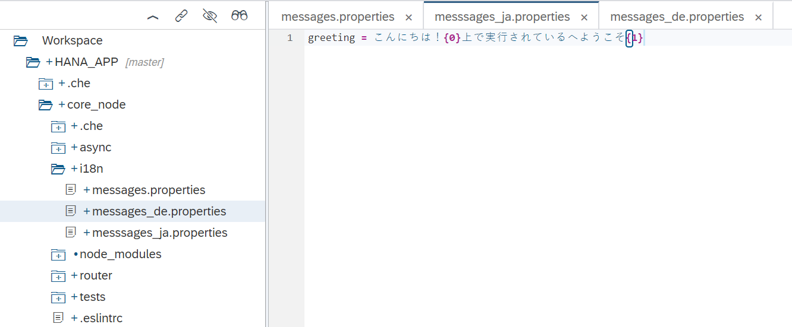

## Prerequisites  
 - **Proficiency:** Intermediate
 - **Tutorials:** [Asynchronous Non-Blocking I/O](http://www.sap.com/developer/tutorials/xsa-node-async.html)

## Next Steps
 - [Web Sockets](http://www.sap.com/developer/tutorials/xsa-node-websockets.html)

## Details
### You will learn  
Working with text bundles in Node.js

**Please note - This tutorial is based on SPS11**

### Time to Complete
**15 Min**.

---

1. Return to the Node.js module and the `server.js` source file.
2. Begin by adding a new Node.js module requirements toward the beginning of the file. For a Node.js module named `./textBundle` which we will create in a moment.

	```
	"use strict";

	var xsjs  = require("sap-xsjs");
	var xsenv = require("sap-xsenv");
	var port  = process.env.PORT || 3000;
	var server = require('http').createServer();
	var express = require("express");
	var node = require("./myNode");
	var exerciseAsync = require("./exerciseAsync");
	var textBundle = require("./textBundle");
	```

3. Add a route for this module that corresponds to `/node/textBundle`

	```
	//Create base Express Server App
	var app = express();
	app.use("/node", node());
	app.use("/node/excAsync", exerciseAsync(server));
	app.use("/node/textBundle", textBundle());

	var options = xsjs.extend({
	```

4. Create a new file in your `js` folder called `textBundle.js`.

	

5. Add the following code to your `textBundle.js` file. It has implemented an HTTP handler for the root URL using express. In the processing of this handler use the `TextBundle` library. When creating a new `TextBundle` instance the input are path (value messages to point to your `message.properties` file) and locale which should call `getLocale` passing in the `req` object. Then write into the `res` object with the `TextBundle` `getText` function (passing in the text ID of greeting and two parameters of `os.hostname()` and `os.type()`.

	```
	"use strict";
	var express = require("express");
	var app = express();
	var os = require("os");
	var TextBundle = require("sap-textbundle");
	var langparser = require("accept-language-parser");

	function getLocale(req) {
		var lang = req.headers["accept-language"];
		if (!lang) {
			return;
		}
		var arr = langparser.parse(lang);
		if (!arr || arr.length < 1) {
			return;
		}
		var locale = arr[0].code;
		if (arr[0].region) {
			locale += "_" + arr[0].region;
		}
		return locale;
	}

	module.exports = function(){

	   app.route("/")
		.get(function(req,res){
			var bundle = new TextBundle({ path: "./i18n/messages", locale: getLocale(req) } );
	 		res.writeHead(200, {"Content-Type": "text/plain; charset=utf-8"});
			var greeting = bundle.getText("greeting", [os.hostname(), os.type()]);
	  		res.end(greeting, "utf-8");
		});
	   return app;
	};
	```

6. Look at the `package.json` file in the editor. You will see the dependencies section which lists all required libraries and their versions. You manually added the `sap-textbundle` and `accept-language-parser` modules to the dependencies section.

	```
	"dependencies": {
	"sap-xsenv": "1.2.1",
	"sap-xsjs": "1.4.0",
	"express": "4.12.3",
	"sap-hdbext": "1.1.2",
    	"sap-xssec": "0.5.3",
    	"passport": "0.2.1",
    	"async": "latest",
    	"ws": "latest",
    	"sap-textbundle": "latest",
    	"accept-language-parser": "latest"      	
	},
	```

7. You need a few text files to test with. Right mouse click on the `js` folder and choose `Import-> From` File System.  Choose the file `i18n.zip` from the Git repo. Keep all other settings at their default values.  Choose **OK**.

	

8. We can now run the `js` module.

	

9. You should see that the build and deploy was successful.

	

10. However if you go to the tab where the service run was started, you will see an 11. Unauthorized message just as in previous sections. This is as intended.

	

11. So now run the `web` module.

	

12. In the running tab, you should see the `index.html` from earlier.  

	

13. Now change the path in the browser to `/node/textBundle`.  You should see the English message output from your text file in the `i18n` folder.

	

14. In order to test the translated strings, go into the browser Settings. Search for Lang and then choose the Language and input settings button.

	

15. Drag and drop to raise German to the top of the list

	

16. Refresh the web browser and you should now see the German text.

	

17. Repeat the process raising Japanese `[ja]` to the top of the list and refresh the web page

	


## Next Steps
 - [Web Sockets](http://www.sap.com/developer/tutorials/xsa-node-websockets.html)
