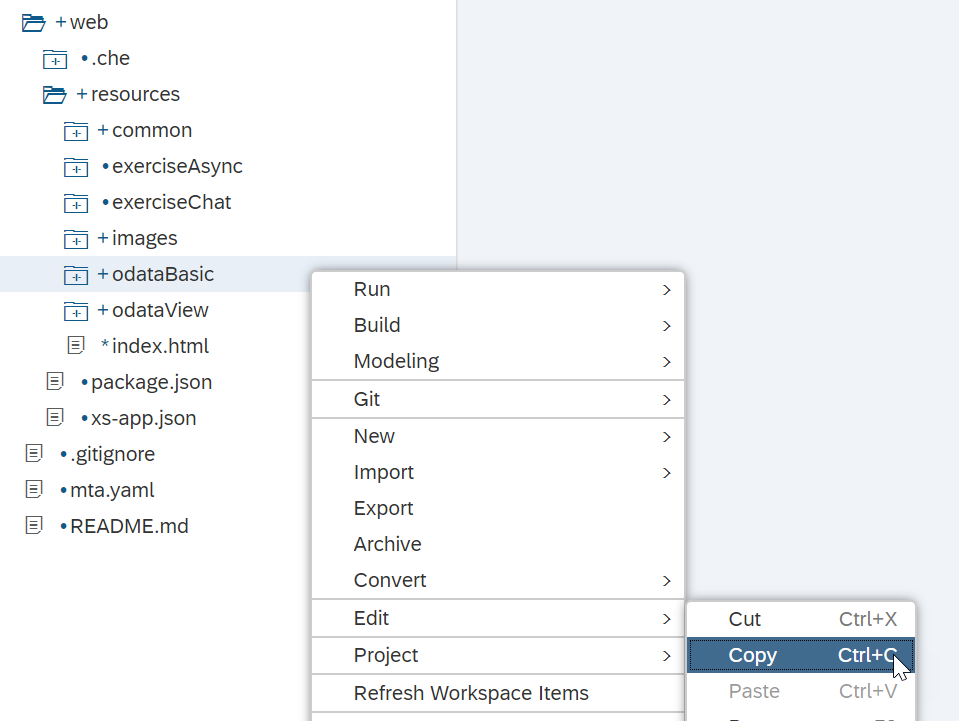
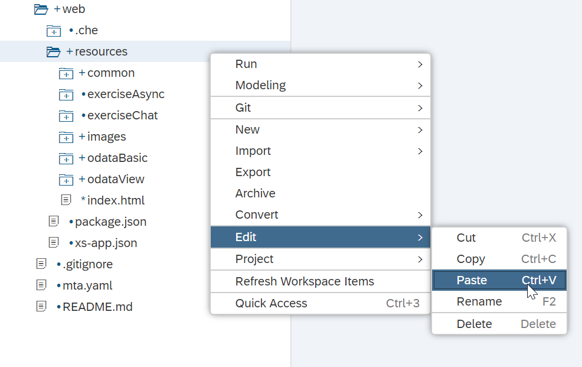
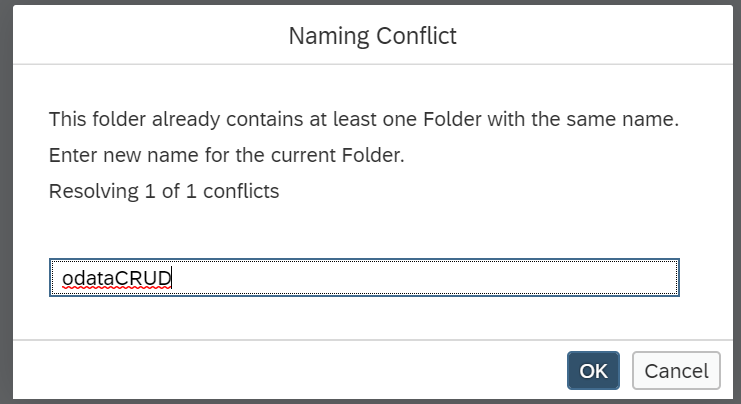
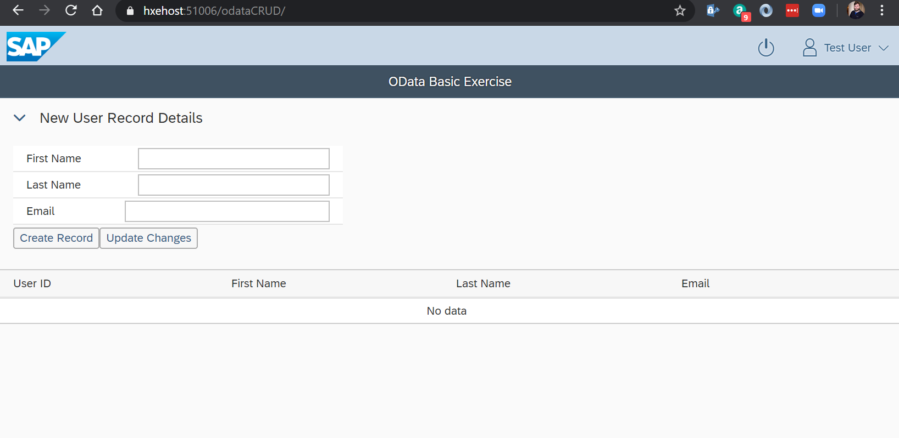
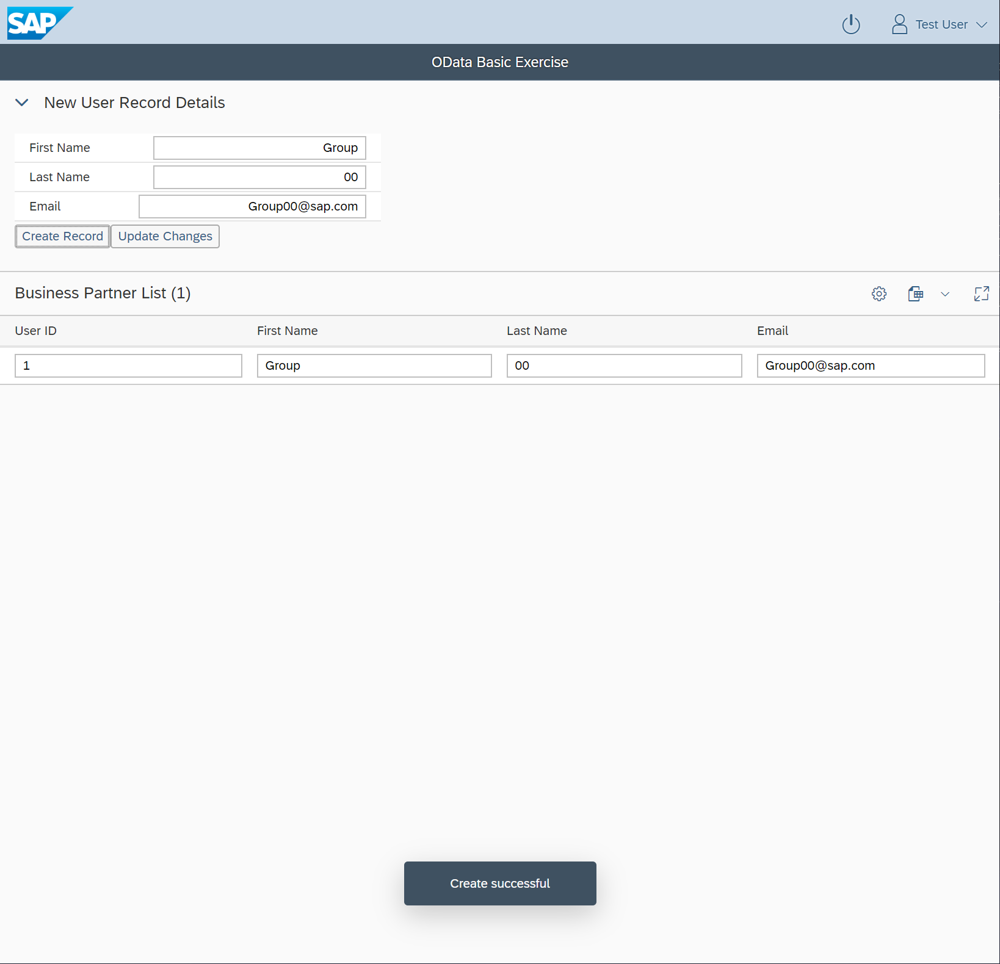
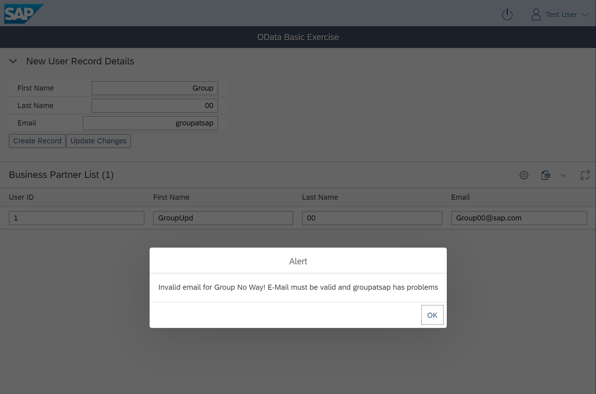

## Prerequisites  
 - **Proficiency:** Intermediate
 - **Tutorials:** [Use OData Metadata to dynamically create the columns](http://www.sap.com/developer/tutorials/xsa-sapui5-metadata.html)

## Next Steps
 - Select a tutorial from the [Tutorial Navigator](http://www.sap.com/developer/tutorial-navigator.html) or the [Tutorial Catalog](http://www.sap.com/developer/tutorials.html)

## Details
### You will learn  
Consume an OData Service with Create Option

**Please note - This tutorial is based on SPS11**

### Time to Complete
**15 Min**.

---

1. You will begin by making a copy of the previous exercise.

	

2. Highlight the `resources` folder and right mouse click. Choose Paste.

	

3. In the copy folder dialog, give the new Name as `odataCRUD`.

	

4. Much of the startup logic will be the same. In the `Component.js` file change the service URL to: `/xsodata/user2.xsodata/`. We must also setup the model binding mode. Change the first part of the `Component.js` file to match the code you see here.

	```
	jQuery.sap.declare("sap.shineNext.odataBasic.Component");


	sap.ui.core.UIComponent.extend("sap.shineNext.odataBasic.Component", {
		init: function(){
			jQuery.sap.require("sap.m.MessageBox");
			jQuery.sap.require("sap.m.MessageToast");		

		    var oModel = new sap.ui.model.odata.ODataModel(
			          "/xsodata/user2.xsodata/", true);
		  	    oModel.setDefaultBindingMode(sap.ui.model.BindingMode.TwoWay);
		  		oModel.attachRejectChange(this,function(oEvent){
		  		    sap.m.MessageBox.alert("You are already editing another Entry! Please submit or reject your pending changes!");
				});

		    sap.ui.getCore().setModel(oModel, "userModel");  

			sap.ui.core.UIComponent.prototype.init.apply(this, arguments);
		},

		createContent: function() {

			var settings = {
					ID: "odataBasic",
					title: "OData Basic Exercise",
					description: "SHINE service for OData Basic Exercise"
				};

			var oView = sap.ui.view({
				id: "app",
				viewName: "sap.shineNext.odataBasic.view.App",
				type: "XML",
				viewData: settings
			});

			 oView.setModel(sap.ui.getCore().getModel("userModel"), "userModel");   
			return oView;
		}
	});
	```

5. Also in the `Component.js` change the page creation to new `sap.ui.xmlview("app", "view.App")`

	```
		var oView = sap.ui.view({
			id: "app",
			viewName: "sap.shineNext.odataBasic.view.App",
			type: "XML",
			viewData: settings
		});
	```

6. Instead of a JavaScript view you are going to use an XML view. Therefore you can delete the `App.view.js` file and then create an `App.view.xml` file instead.

	

7. The complete View Implementation for `App.view.xml` is provided for you as a template.  It has a table control built from the OData service  `/xsodata/user2.xsodata/` - all of which is very similar to the earlier exercise. In addition, this view has input fields for creating a new record. It also has the ability to update records in the table control; not just display them. The template can be accessed at: `http://<hostname>:51013/workshop/admin/ui/exerciseMaster/?workshop=dev602&sub=ex4_14`

	

8. In this exercise we will focus on the implement of the event handlers – which is all done in the `controller.js` file.
9. You need to add to event handlers, `onInit`, `callUserService` (which performs the creation of new records) and `callUserUpdate` (which updates records from the table) and `onErrorCall` (and error handler). Insert the empty functions in the controller as shown.

	

10. For the `onInit` you need to create an empty JSON model for our input fields and set it into the view.

	```
	onInit : function(){
		var model = new sap.ui.model.json.JSONModel({});
                this.getView().setModel(model);
 	},
	```

11. For `callUserService`, you first need to get access to the model object. Next you need to create a JSON object with the service fields (`PERS_NO`, `FIRSTNAME`, `LASTNAME`, and `E_MAIL`). `PERS_NO` can get a hard coded value of "0000000000".  The other fields should be read from the screen with the bound JSON model Finally you need to set a custom header of `content-type` with the value of `application/json;charset=utf-8` in the model. Then you can call the `model.create` function for the entity `/Users`. If you need help writing this code please refer to the solution at: `http://<hostname>:51013/workshop/admin/ui/exerciseMaster/?workshop=dev602&sub=ex4_15`

	```
	callUserService : function() {
		var oModel = sap.ui.getCore().getModel("userModel");
		var result = this.getView().getModel().getData();
		var oEntry = {};
		oEntry.PERS_NO = "0000000000";
		oEntry.FIRSTNAME = result.FirstName;
		oEntry.LASTNAME = result.LastName;
		oEntry.E_MAIL = result.Email;

		oModel.setHeaders({"content-type" : "application/json;charset=utf-8"});
		oModel.create("/Users", oEntry, null, function() {
		    sap.m.MessageToast.show("Create successful");
		}, this.onErrorCall);
	},
	```

12. The implementation of `callUserUpdate` is actually much simpler. You are using two-way model binding therefore you need only ask the model to submit any pending changes and capture the response status events. If you need help writing this code please refer to the solution at: `http://<hostname>:51013/workshop/admin/ui/exerciseMaster/?workshop=dev602&sub=ex4_16`

	```
	callUserUpdate: function() {
	 var oModel = sap.ui.getCore().getModel("userModel");
		oModel.submitChanges(
	  function(){sap.m.MessageToast.show("Update successful");},
	function(){sap.m.MessageToast.show("Update failed");});
	},
	```

13. In the `onErrorCall` you want to be able to parse the error body to pull out the detailed error message. If you need help writing this code please refer to the solution at: `http://<hostname>:51013/workshop/admin/ui/exerciseMaster/?workshop=dev602&sub=ex4_17`

	```
	onErrorCall: function(oError){
	    if(oError.response.statusCode === 500 || oError.response.statusCode === 400){
	     var errorRes = JSON.parse(oError.response.body);
                        sap.m.MessageBox.alert(errorRes.error.message.value);
	return;
 	 }
  	 else{
	         sap.m.MessageBox.alert(oError.response.statusText);
	return;
 	 }
	}
	```

14. Save the files.
15. Test your application in a web browser using the Run option. The URL would be `/odataCRUD/`. Try both creating a new record and editing existing records. Also try creating a record with an invalid email address.

	

	


## Next Steps
 - Select a tutorial from the [Tutorial Navigator](http://www.sap.com/developer/tutorial-navigator.html) or the [Tutorial Catalog](http://www.sap.com/developer/tutorials.html)
