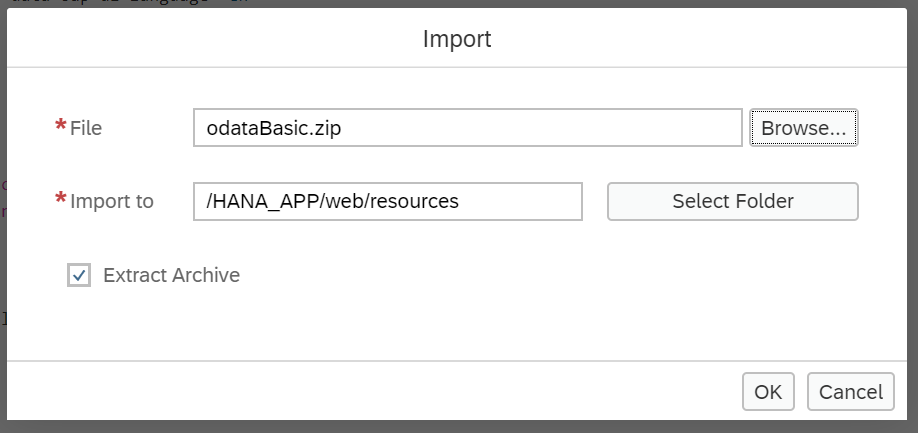
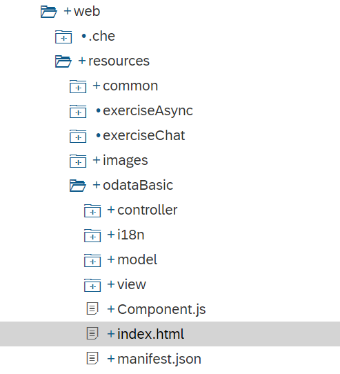

## Prerequisites  
 - **Proficiency:** Intermediate
 - **Tutorials:** [SAPUI5 User Interface](http://www.sap.com/developer/tutorials/xsa-sapui5.html)

## Next Steps
 - [Use OData Metadata to dynamically create the columns](http://www.sap.com/developer/tutorials/xsa-sapui5-metadata.html)

## Details
### You will learn  
Consume a Basic OData Service within UI5 binding the service to a Table.

**Please note - This tutorial is based on SPS11**

### Time to Complete
**15 Min**.

---

1. Create a folder named `odataBasic` within the `web/resources` folder

	

2. Within this folder, create two files – one named `Component.js` and one named `index.html`.  Also create a sub-folder named view.

	

3. Within the view folder you just created, please now create two files – `App.controller.js` and `App.view.js`

	

4. To avoid having to do too much typing, we have prepared some template code for you.  In the `index.html` we need to insert the basic UI5 `bootstrap` and initialization code. This page will create a single html content item and then start the `Component.js` file which contains the rest of the true application startup logic. We recommend that you cut and paste it from this web address `http://<hostname>:51013/workshop/admin/ui/exerciseMaster/?workshop=dev602&sub=ex4_10`

	```
	<!DOCTYPE html>
	<html>
	<head>
		<meta http-equiv="X-UA-Compatible" content="IE=edge" />
		<meta charset="UTF-8">
		<meta name="viewport" content="width=device-width, initial-scale=1.0, maximum-scale=1.0, user-scalable=no" />
		<title>OData Basic Exercise</title>
	   		<link type="image/x-icon" href="/ images/favicon.ico" rel="shortcut icon">
	        <link type="image/x-icon" href="/ images/favicon.ico" rel="icon">
		<script id="sap-ui-bootstrap"
			src="https://sapui5.hana.ondemand.com/resources/sap-ui-core.js"
			data-sap-ui-theme="sap_bluecrystal"
			data-sap-ui-xx-bindingSyntax="complex"
			data-sap-ui-resourceroots='{
					"sap.shineNext.odataBasic": "./",
					"view": "./view" }'		
			data-sap-ui-libs="sap.m, sap.me">
		</script>

		<script>

		new sap.m.Shell({
			app : new sap.ui.core.ComponentContainer({
				name : "sap.shineNext.odataBasic"
			})
		}).placeAt("content");

		</script>
	</head>
	<body class="sapUiBody" role="application">
		<div id="content"></div>
	</body>
	</html>
	```

5. In the `Component.js` file you initialize the application and set the base UI elements for the page. We recommend that you cut and paste it from this web address `http://<hostname>:51013/workshop/admin/ui/exerciseMaster/?workshop=dev602&sub=ex4_11` You should notice that there are commented `To-Do` sections in this code which you just copied into the file. These are the most important parts and will be completed in the next few steps.

	```
	jQuery.sap.declare("sap.shineNext.odataBasic.Component");


	sap.ui.core.UIComponent.extend("sap.shineNext.odataBasic.Component", {

		createContent: function() {
			//To-Do: Insert Model Here

			var settings = {
					ID: "odataBasic",
					title: "OData Basic Exercise",
					description: "SHINE service for OData Basic Exercise"
				};

			var oView = sap.ui.view({
				id: "app",
				viewName: "sap.shineNext.odataBasic.view.App",
				type: "JS",
				viewData: settings
			});

			 oView.setModel(oModel, "bpModel");  
			return oView;
		}
	});
	```

6. Since this is a simple example application we won't need any controller logic. Just insert this empty controller logic.

	```
	sap.ui.controller("sap.shineNext.odataBasic.view.App",{

	});
	```

7. For the view definition to avoid having to do too much typing, we have prepared some template code for you which already has the definition of the table UI element and the table columns, but none of the logic to consume the OData service. You can cut and paste this template code from this address into the `odataBasic.view.js` file: Note: if you don't want to type this code, we recommend that you cut and paste it from this web address `http://<hostname>:51013/workshop/admin/ui/exerciseMaster/?workshop=dev602&sub=ex4_12` You should notice that there are commented To-Do sections in this code which you just copied into the file. These are the most important parts and will be completed in the next few steps.

	```
	sap.ui.jsview("sap.shineNext.odataBasic.view.App", {

        getControllerName: function() {
            return "sap.shineNext.odataBasic.view.App";
        },

        createContent: function(oController) {
	        this.addStyleClass("sapUiSizeCompact"); // make everything inside this View appear in Compact mode

            var oTable = new sap.m.Table("bpTable", {
                tableId: "bpTable",
                growingThreshold: 10,
                growing: true
            });
			var columnList = new sap.m.ColumnListItem();

			//To-Do: Connect model to table and bind and sort


            //Table Column Definitions
            oTable.addColumn(new sap.m.Column({
                header: new sap.m.Label({
                    text: "Partner ID"
                }),
                width: "125px"
            }));
            columnList.addCell(new sap.m.Text({
                text: {
                    path: "bpModel>PARTNERID"
                },
                name: "PARTNERID"
            }));

            oTable.addColumn(new sap.m.Column({
                header: new sap.m.Label({
                    text: "Email Address"
                }),
                width: "125px"
            }));
            columnList.addCell(new sap.m.Text({
                text: {
                    path: "bpModel>EMAILADDRESS"
                },
                name: "EMAILADDRESS"
            }));

            oTable.addColumn(new sap.m.Column({
                header: new sap.m.Label({
                    text: "Phone Number"
                }),
                width: "125px"
            }));
            columnList.addCell(new sap.m.Text({
                text: {
                    path: "bpModel>PHONENUMBER"
                },
                name: "PHONENUMBER"
            }));

            oTable.addColumn(new sap.m.Column({
                header: new sap.m.Label({
                    text: "Fax Number"
                }),
                width: "125px"
            }));
            columnList.addCell(new sap.m.Text({
                text: {
                    path: "bpModel>FAXNUMBER"
                },
                name: "FAXNUMBER"
            }));

            oTable.addColumn(new sap.m.Column({
                header: new sap.m.Label({
                    text: "Legal Form"
                }),
                width: "125px"
            }));
            columnList.addCell(new sap.m.Text({
                text: {
                    path: "bpModel>LEGALFORM"
                },
                name: "LEGALFORM"
            }));

            oTable.addColumn(new sap.m.Column({
                header: new sap.m.Label({
                    text: "Currency"
                }),
                width: "125px"
            }));
            columnList.addCell(new sap.m.Text({
                text: {
                    path: "bpModel>CURRENCY"
                },
                name: "CURRENCY"
            }));

            oTable.addColumn(new sap.m.Column({
                header: new sap.m.Label({
                    text: "Web Address"
                }),
                width: "125px"
            }));
            columnList.addCell(new sap.m.Link({
                text: {
                    path: "bpModel>WEBADDRESS"
                },
                href: {
                    path: "bpModel>WEBADDRESS"
                },
                target: "_blank",
                name: "WEBADDRESS"
            }));

        var displayPanel = new sap.m.Panel("dispPanel").setHeaderText('Business Partner Details');
        displayPanel.setExpandable(true);
        displayPanel.setExpanded(true);

        displayPanel.addContent(oTable);
       return displayPanel;
      }
	});
	```

8. In the first `To-Do` location in the `Component.js` file, you should add the code to create a model object named `oModel` of type `sap.ui.model.odata.ODataModel`. Use the provided service `/sap/hana/democontent/epmNext/services/businessPartners.xsodata/`.

	

	```
	var oModel = new sap.ui.model.odata.ODataModel("/xsodata/businessPartners.xsodata/", true);
	sap.ui.getCore().setModel(oModel, "bpModel");   
	```

9. In the second To-Do location in the `App.view.js` file, you should set the model named `bpModel` to the table control named `oTable`. Create a sorter (type `sap.ui.model.Sorter`) which uses the column `PartnerId`. Bind the table to the entity `BusinessPartners` and add the sorter object to the binding.

	

	```
	var sort1 = new sap.ui.model.Sorter("PARTNERID");
            var columnList = new sap.m.ColumnListItem();
            oTable.bindItems({
                path: "bpModel>/BusinessPartners",
                template: columnList,
                sorter: sort1
	});
	```

10. That's all that is necessary to connect the Table UI element to the OData service.  We get built in table sorting and filtering, as well as server side scrolling via the various built-in parameters of the OData service framework. Save your files, run the HTML5 (`web`) module.

	

11. Adjust the run URL to `/odataBasic/`.   

	

## Next Steps
 - [Use OData Metadata to dynamically create the columns](http://www.sap.com/developer/tutorials/xsa-sapui5-metadata.html)
