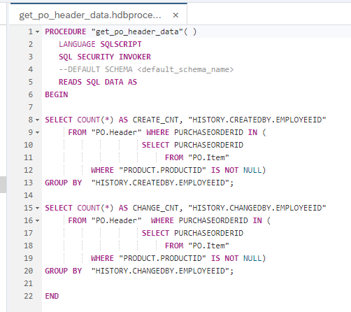
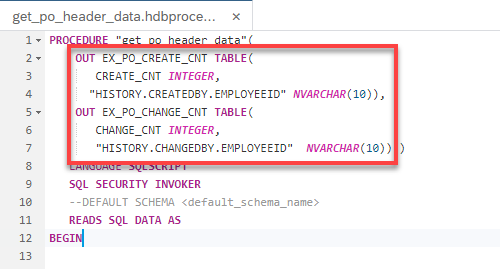
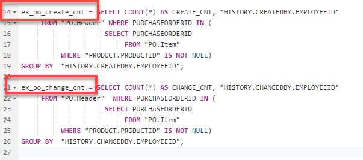
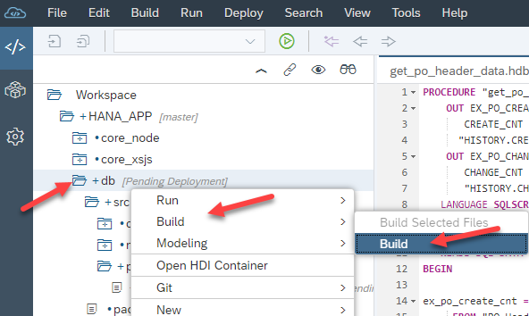
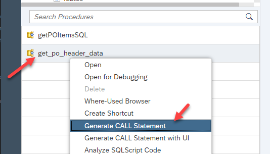

## Prerequisites  
 - **Proficiency:** Intermediate
 - **Tutorials:** [Creating Stored Procedures](http://www.sap.com/developer/tutorials/xsa-sqlscript-stored-proc.html)

## Next Steps
 - [Intermediate Table Variables](http://www.sap.com/developer/tutorials/xsa-sqlscript-table-var.html)

## Details
### You will learn  
In this exercise we will modify the code of procedure `get_po_header_data`  so that it takes full advantage of the parallel processing within HANA by using table variables.
**Please note - This tutorial is based on SPS11**

### Time to Complete
**15 Min**.

---

1. Return to your procedure called `get_po_header_data`.

	

2. Define two tabular output parameters which will be used to explicitly pass the results of the SELECT statements to the caller.

	

3. Next, assign SELECT statements to the output parameters as shown here.

	

4. The completed code should be similar to this. If you do not wish to type this code, you can reference the solution web page at `http://<hostname>:51013/workshop/admin/ui/exerciseMaster/?workshop=dev602&sub=ex2_11`

    ```
    PROCEDURE "dev602.procedures::get_po_header_data" (
        OUT EX_PO_CREATE_CNT TABLE(
           CREATE_CNT INTEGER,
          "HISTORY.CREATEDBY.EMPLOYEEID" NVARCHAR(10)),
        OUT EX_PO_CHANGE_CNT TABLE(
           CHANGE_CNT INTEGER,
           "HISTORY.CHANGEDBY.EMPLOYEEID"  NVARCHAR(10)) )  
   	LANGUAGE SQLSCRIPT
   	SQL SECURITY INVOKER
   	--DEFAULT SCHEMA <default_schema_name>
   	READS SQL DATA AS
	BEGIN

	ex_po_create_cnt =  SELECT COUNT(*) AS CREATE_CNT, "HISTORY.CREATEDBY.EMPLOYEEID"
         FROM "dev602.data::PO.Header" WHERE PURCHASEORDERID IN (
                SELECT PURCHASEORDERID
                       FROM "dev602.data::PO.Item"
          WHERE "PRODUCT.PRODUCTID" IS NOT NULL)
  	GROUP BY  "HISTORY.CREATEDBY.EMPLOYEEID";

	ex_po_change_cnt =  SELECT COUNT(*) AS CHANGE_CNT, "HISTORY.CHANGEDBY.EMPLOYEEID"
         FROM "dev602.data::PO.Header"  WHERE PURCHASEORDERID IN (
                 SELECT PURCHASEORDERID
                      FROM "dev602.data::PO.Item"
          WHERE "PRODUCT.PRODUCTID" IS NOT NULL)
        GROUP BY  "HISTORY.CHANGEDBY.EMPLOYEEID";

	END
    ```

5. Save the procedure.

	

6. Perform a build on the `hdb` module.

	

7. Return to the HRTT page and invoke the procedure again.

	

8. The CALL statement will be inserted into a new "SQL" tab

	

9. Click the "Run" button

	

10. Check the execution time again, you may notice that it is a bit faster this time. The reason is that these SQL statements are now executed in parallel.

	


## Next Steps
 - [Intermediate Table Variables](http://www.sap.com/developer/tutorials/xsa-sqlscript-table-var.html)
