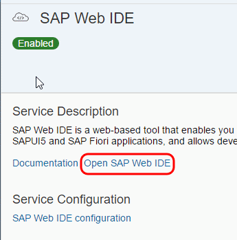
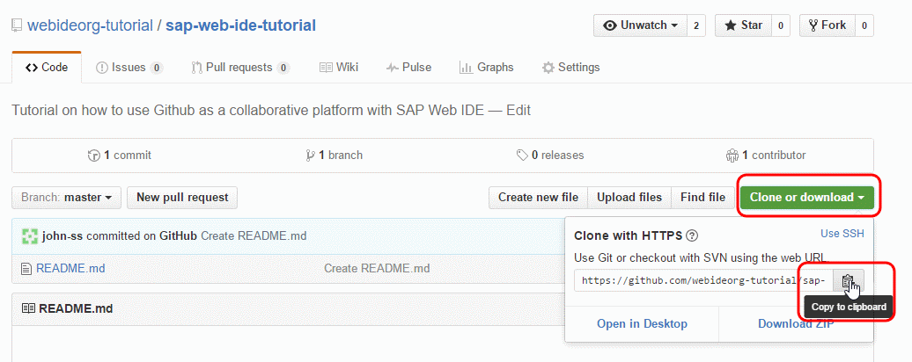
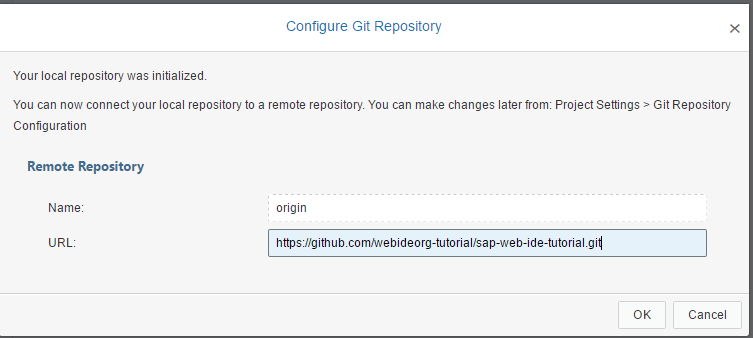
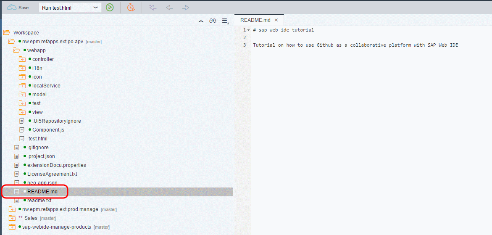
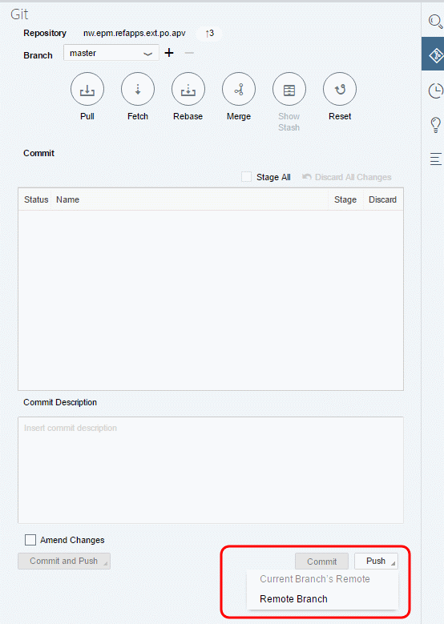

## Prerequisites  
 - **Proficiency:** Intermediate
 - **Tutorials:**
  - [Create a repo within the Organization](https://www.sap.com/developer/tutorials/webide-github-create-git-repo.html)
  - [Build an app from an SAP Web IDE template](https://www.sap.com/developer/tutorials/hcp-template-mobile-web-app.html)

## Next Steps
 - [Using issues, setting milestones and assigning issues to collaborators](https://www.sap.com/developer/tutorials/webide-github-issues-milestones.html)

## Details
### You will learn  
In this tutorial, you'll learn how to import an existing SAP Web IDE project into your previously created GitHub repository.

### Time to Complete
**15 Min**.

---

1. Go to [https://account.hanatrial.ondemand.com](https://account.hanatrial.ondemand.com) and log in to your SAP Cloud Platform cockpit.

2. To open SAP Web IDE, click on the **Services** tab in the navigation bar, scroll down and then click the **SAP Web IDE** tile to open the SAP Web IDE service page.

    

3. Click on **Open SAP Web IDE** to launch SAP Web IDE.

    

4. Open your existing project in SAP Web IDE by clicking on **File** &rarr; **Import**.

5. Once your project is open, right-click on your Project folder and click on **Git** &rarr; **Initialize Local Repository**.

    

6. In the **Configure Git Repository** dialog box, enter your GitHub Organization repository's URL

    a. Fetch the Remote repository URL by heading over to the GitHub Organization URL. Click on the **Clone or Download** button and then select the icon to copy URL to clipboard selecting the Repository.

    

    b. Paste this URL into the remote repository textbox.

    

7. Your project is now initialized with a Git repository and linked to the GitHub platform. You can open the Git pane on the right sidebar to verify this.

    

8. Next, commit the project files to the local Git repository by clicking on **Stage all** checkbox, enter a commit description and then click on the **Commit** button.

    

9. Next to synchronize GitHub repository and local repository changes, click on the **Pull** button. Enter your GitHub credentials.

    

10. Once the pull is complete you'll notice the README file created on GitHub is now available in Web IDE project workspace.

    

11. To push your local changes to GitHub.

    a. Click on the **Push** button and select **Remote Branch**

    

    b. Select **origin/master** as the remote branch and click on **OK**.

    

    c. Enter your GitHub credentials and click on **OK**.

    d. Once push is completed you will see a notification message on the top right corner.

    

12. Go to the Organization GitHub URL and you will notice that the changes are now published.

## Next Steps
 - [Using issues, setting milestones and assigning issues to collaborators](https://www.sap.com/developer/tutorials/webide-github-issues-milestones.html)
