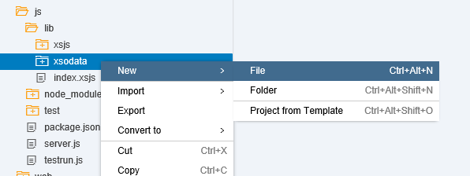
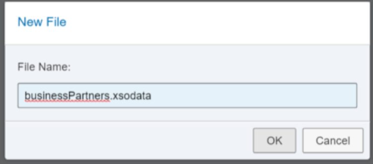
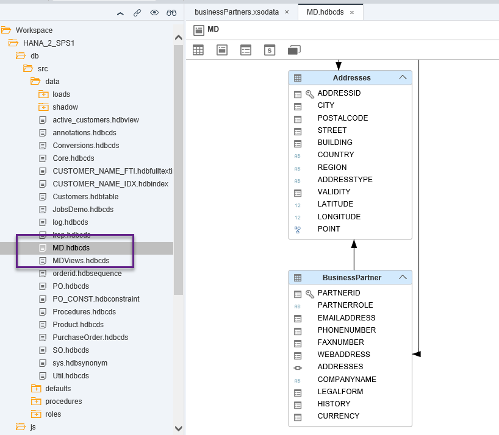
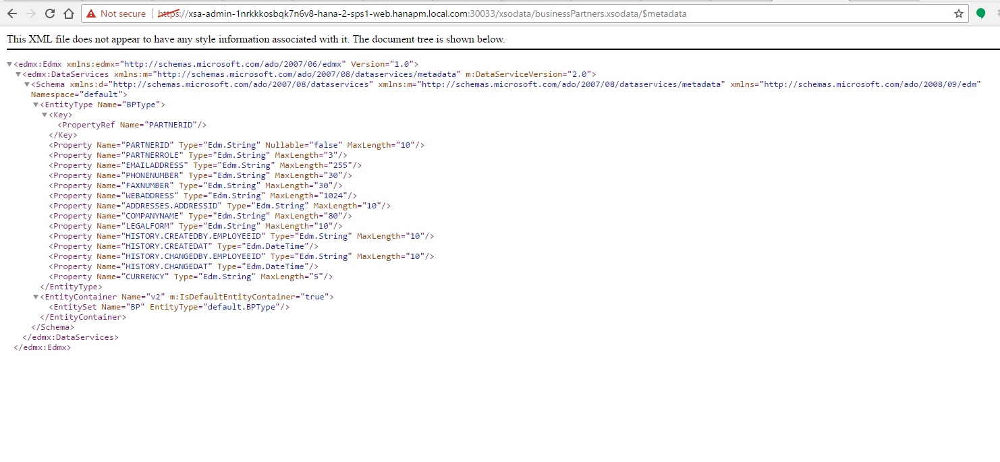
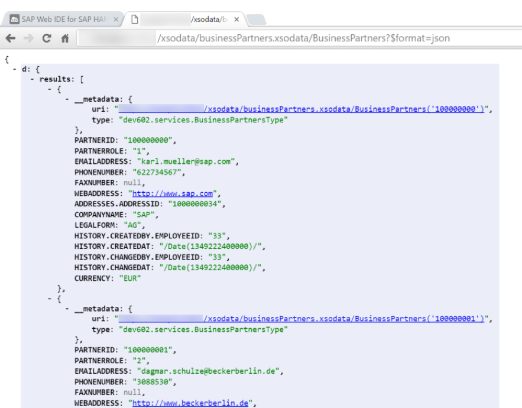
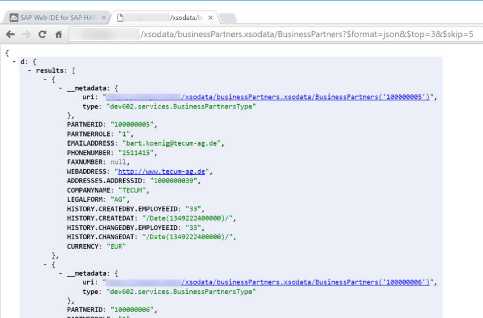

## Prerequisites  
- **Proficiency:** Intermediate
- **Tutorials:**
- [Import tables and large Datasets](https://www.sap.com/developer/tutorials/xsa-import-shine-data.html)
- [SAP HANA XS Advanced, Creating a Node.js Module](https://www.sap.com/developer/tutorials/xsa-xsjs-xsodata.html)

## Next Steps
- [Create and OData Service with Entity Relationship](https://www.sap.com/developer/tutorials/xsa-xsodata-entity.html)

## Details
### You will learn  
Create a simple OData service connecting to your table and data.

### Time to Complete
**10 Min**.

---

[ACCORDION-BEGIN [Step 1: ](Create new file)]

Right mouse click on the `js/lib/xsodata` folder and choose `New->File`.



Enter the name as `businessPartners.xsodata` and click **OK**.




[ACCORDION-END]

[ACCORDION-BEGIN [Step 2: ](Expose business partner table)]

You want to define an OData service to expose the business partner table. This table is in defined in the `MD.hdbcds` artifact.



The syntax of the XSODATA service is relatively easy for this use case. You need only define a namespace (your package path), the name of the HANA Table you will base the service from (`MD.BusinessPartner`) and the name or alias of the OData entity (`BP`). Therefore the content of the XSODATA file would be:

```
service{
	"MD.BusinessPartner" as "BP";
}

```


[ACCORDION-END]

[ACCORDION-BEGIN [Step 3: ](Save and run)]

Save the file and build the Node.js module. Then run the `html5` module (defined as `web` earlier). Once it opens a separate browser tab, change the URL path to `/xsodata/businessPartners.xsodata` to test this new service. The resulting document describes the service entities.  You have the one entity named `BP`.


[ACCORDION-END]

[ACCORDION-BEGIN [Step 4: ](Append URL)]

You can now adjust the URL slightly and add the `/$metadata` parameter to the end of it.

For Example: `/xsodata/businessPartners.xsodata/$metadata`

You can see the field descriptions for all the attributes of the OData service.




[ACCORDION-END]

[ACCORDION-BEGIN [Step 5: ](View data)]

In order to view the data of the entity, you would append `BP` to the end of the URL:

For Example:
`/xsodata/businessPartners.xsodata/BP?$format=json`

You are now able to see the data from the `businessPartner` table.  




[ACCORDION-END]


[ACCORDION-BEGIN [Step 6: ](Try other parameters)]


You can also experiment with standard OData URL parameters like $top, $skip, or $filter.  These options are interpreted and handled by the OData service of the `XSEngine` for you.  You get complex service handling without any coding. For example the following URL would return only three business partner records and would skip the first five records.  Such parameters are helpful when implementing server side scrolling, filtering, or sorting in table UI elements.


For Example:
`/xsodata/businessPartners.xsodata/BP?$top=3&$skip=5&$format=json`




[ACCORDION-END]


## Next Steps
- [Create and OData Service with Entity Relationship](https://www.sap.com/developer/tutorials/xsa-xsodata-entity.html)
